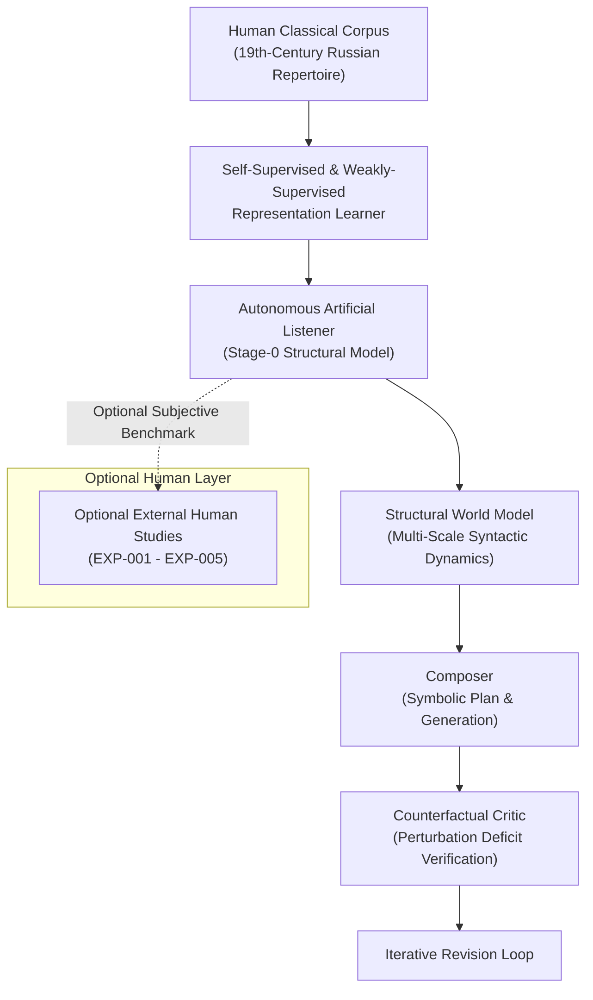
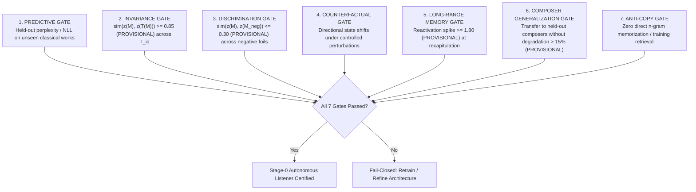

# PF-001A: Autonomous Artificial Listener Contract Specification
## Autonomous Classical Representation Learning, Structural Invariance, and Multi-Scale Listener Modeling

**Document Type:** Scientific Architecture & Autonomous Contract  
**Milestone:** PF-001A  
**Project:** Russian Piano Composer  
**Status:** AUTONOMOUS_LISTENER_CONTRACT_FROZEN_READY_FOR_CORPUS_FEASIBILITY  
**Governing Standard:** Corpus-Observable Structural Supervision & Counterfactual Listener Verification  

---

### Executive Statement & Scientific Inversion

PF-001A updates and clarifies the foundational contract of the **Perception-First Classical Composition** architecture:

> **Core Principle:** Human participant listening studies are **not** required as the Stage-0 training or gating prerequisite.  
> The primary teacher is the **corpus of human-composed classical music itself**.

The governing autonomous loop is defined as:
$$\text{HUMAN CLASSICAL CORPUS} \longrightarrow \text{SELF-SUPERVISED REPRESENTATION LEARNER} \longrightarrow \text{ARTIFICIAL LISTENER}$$
$$\longrightarrow \text{STRUCTURAL WORLD MODEL} \longrightarrow \text{COMPOSER} \longrightarrow \text{COUNTERFACTUAL CRITIC} \longrightarrow \text{REVISION}$$

Human listening studies are reclassified as an **`OPTIONAL_EXTERNAL_VALIDATION`** layer. They are strictly required only when making an explicit claim regarding human subjective experience (e.g., *"human listeners judge this passage as tense"*), but autonomous structural model development, representation learning, and composer criticism do not depend on human participant data collection.

---

### 1. Stage-0 Autonomous State Variables & Mathematical Formulations

To preserve scientific truthfulness, internal model variables are strictly designated as **structural quantities** rather than making unverified claims of human perceptual equivalence:

| State Variable | Notation | Mathematical Definition | Corpus Supervision Source | Multi-Scale Scope |
| :--- | :--- | :--- | :--- | :--- |
| **Structural Expectation** | $E_s(t)$ | $P(x_{t+1} \mid x_{\le t})$ | Corpus token/event sequences; self-supervised masked & causal autoregression | Event, Motif, Phrase, Section |
| **Structural Uncertainty** | $U_s(t)$ | $H\left[P(x_{t+1} \mid x_{\le t})\right] = -\sum_k p_k \log_2 p_k$ | Derived informational entropy of conditional predictive distribution | Event, Motif, Phrase |
| **Structural Surprise** | $S_s(t)$ | $-\log_2 P(x_t \mid x_{<t})$ | Derived negative log-likelihood of observed event under prior context | Event, Chord, Cadence |
| **Structural Closure** | $C_s(t)$ | $P(\text{boundary} \mid x_{\le t}) \in [0, 1]$ | Corpus-observable cadential, phrase, and formal boundaries | Phrase, Section, Piece |
| **Motif Identity** | $R_m(t)$ | $\text{sim}(z(M), z(T(M))) = \frac{z(M) \cdot z(T(M))}{\|z(M)\|\|z(T(M)\|}$ | Self-supervised contrastive learning with synthetic morphological transformations | Motif, Sub-phrase |
| **Structural Memory** | $M_s(t)$ | $m_k(t) = \text{sim}(z(M_k), h_t)$ | Memory buffer attention / associative retrieval trace over preceding context | Phrase, Section, Whole-Piece |

#### 1.1 Structural Expectation ($E_s(t)$)
The predictive model must learn conditional distributions across multiple musical hierarchies:
$$E_s(t) = \left\{ P_{\text{event}}(e_{t+1} \mid e_{\le t}), P_{\text{motif}}(m_{k+1} \mid m_{\le k}), P_{\text{phrase}}(\phi_{j+1} \mid \phi_{\le j}), P_{\text{section}}(S_{r+1} \mid S_{\le r}) \right\}$$
Prediction is not restricted to raw MIDI pitch-onsets; it operates over hierarchical syntactic entities (tonal roots, voice-leading intervals, harmonic functions, metric accent classes).

#### 1.2 Structural Uncertainty ($U_s(t)$) & Structural Surprise ($S_s(t)$)
- $U_s(t)$ measures the dispersion across predictive space under the learned model. A high $U_s(t)$ signifies that the corpus distribution contains multiple viable syntactic paths (e.g., developmental sequential modulations). It does not assert that a human listener feels psychological anxiety.
- $S_s(t)$ measures the information-theoretic surprisal of realized transitions.

#### 1.3 Structural Closure ($C_s(t)$)
Trained as a weakly-supervised boundary detector using corpus-observable structural markers:
1. Cadential signatures: Perfect authentic cadences (PAC), imperfect authentic cadences (IAC), half cadences (HC), deceptive cadences (DC).
2. Metrical hypermetric phrase terminations (e.g. 4-bar, 8-bar boundaries with harmonic resolution).
3. Sectional double barlines and formal recapitulation entries.
*Invariant:* Structural closure must not be equated with low tension. A peaceful, harmonically open modal passage has zero closure despite low tension; an authentic cadence preceding an urgent fermata has maximal closure.

#### 1.4 Motif Identity & Representation Learning ($R_m(t)$)
The motif encoder $z(\cdot)$ must satisfy a formal **Invariance-to-Discrimination Contrastive Contract**:
1. **Invariance:** For any identity-preserving transformation $T \in \mathcal{T}_{\text{id}}$:
   $$\| z(M) - z(T(M)) \| \le \epsilon_{\text{inv}}$$
   where $\mathcal{T}_{\text{id}}$ includes exact transposition, octave/register displacement, rhythmic augmentation/diminution, controlled melodic ornamentation (passing notes, appoggiaturas), and polyphonic accompaniment variations.
2. **Discriminability:** For any distinct negative motif foil $M_{\text{neg}}$ or identity-destroying chromatic scrambling $T_{\text{destr}}$:
   $$\| z(M) - z(M_{\text{neg}}) \| \ge \delta_{\text{disc}} \gg \epsilon_{\text{inv}}$$
   This dual requirement guarantees that the representation space does not collapse into a degenerate trivial constant.

#### 1.5 Long-Range Structural Memory Trace ($M_s(t)$)
Memory is defined structurally as the explicit reactivation trace $m_k(t) = \text{sim}(z(M_k), h_t)$.
The model must pass four prospective persistence tests:
- *Disappearance:* $m_k(t)$ decays toward baseline during unexposed development episodes.
- *Partial Hint:* A 2-note thematic incipit produces an intermediate activation spike.
- *Transformed Recurrence:* Recurrence of $M_k$ under diminution or transposition reactivates $m_k(t) \ge 0.70$ (`PROVISIONAL_UNCALIBRATED_TARGET`).
- *Full Recurrence:* Full literal recurrence at recapitulation restores $m_k(t) \ge 0.90$ (`PROVISIONAL_UNCALIBRATED_TARGET`).

---

### 2. Autonomous Theme Fertility ($T_I(M)$)

Rather than optimizing an arbitrary subjective quality score, **Autonomous Theme Fertility** is formalized as the volume and diversity of the admissible transformation space under the frozen motif representation:

$$T_I(M; \tau) = \left\{ M' \in \mathcal{T}(M) : \text{sim}\left( z(M), z(M') \right) \ge \tau \right\}$$

$$\text{Fertility}(M) = \text{Coverage}\left( T_I(M; \tau) \right) = \mathbb{E}_{T \sim \mathcal{T}}\left[ \mathbb{I}\left( \text{sim}(z(M), z(T(M))) \ge \tau \right) \cdot \text{Diversity}(T) \right]$$

*Scientific Invariant:* Theme Fertility is defined strictly for measurement, analysis, and ranking in PF-001A. Automatic optimization of fertility during composition is **prohibited** until Stage-0 listener models pass all validation gates.

---

### 3. Multi-Scale Representation Contract

The Artificial Listener must maintain explicit representation streams or probes across five hierarchical timescales:
1. **Event Scale ($\sim 100 - 500\text{ ms}$):** Pitch, duration, voice, velocity, melodic interval.
2. **Motif Scale ($\sim 1 - 4\text{ seconds}$):** Melodic contour, rhythmic motif, harmonic cell.
3. **Phrase Scale ($\sim 4 - 16\text{ seconds}$):** Antecedent-consequent pairing, cadential arrival, phrase breath.
4. **Section Scale ($\sim 30 - 120\text{ seconds}$):** Thematic exposition, episodic modulation, climactic buildup.
5. **Whole-Piece Scale ($\sim 2 - 15\text{ minutes}$):** Global tonality arc, cyclic thematic return, formal sonata/rondo architecture.

Compressing all temporal hierarchies into an unstratified single latent vector without scale identity violates the multi-scale contract.

---

### 4. Autonomous Scientific Validation Gates

Candidate Artificial Listener models must pass seven machine-readable autonomous gates before being approved as composer critics:

> [!NOTE]
> **Threshold De-Provisionalization Protocol (PF-001B / PF-001C):**
> All numerical thresholds enumerated below were initially proposed prior to empirical dataset calibration. Under PF-001B, every specific numerical cutoff is classified as `PROVISIONAL_UNCALIBRATED_TARGET`. Final operational cutoffs will be empirically de-provisionalized in milestone **PF-001C** using:
> 1. Information-weighted melodic n-gram background frequency distributions;
> 2. Rare-pattern vs. common-formula weighting (cadential formulas, scale runs);
> 3. Empirical nearest-neighbor cosine distance percentiles observed on held-out human classical control sets.

1. **`PREDICTIVE_GATE`:** Negative log-likelihood and calibration error on held-out compositions within the `validation` pool.
2. **`INVARIANCE_GATE`:** Mean cosine similarity across identity-preserving transformations must satisfy $\mathbb{E}[\text{sim}(z(M), z(T_{\text{id}}(M)))] \ge 0.85$ (`PROVISIONAL_UNCALIBRATED_TARGET`, pending PF-001C empirical distribution calibration).
3. **`DISCRIMINATION_GATE`:** Mean cosine similarity against negative foils must satisfy $\mathbb{E}[\text{sim}(z(M), z(M_{\text{foil}}))] \le 0.30$ (`PROVISIONAL_UNCALIBRATED_TARGET`), with separation $\text{AUROC} \ge 0.95$ (`PROVISIONAL_UNCALIBRATED_TARGET`).
4. **`COUNTERFACTUAL_GATE`:**
   - Cadence disruption: Shifting a cadential resolution note decreases $C_s(t)$ by $\ge 0.40$ (`PROVISIONAL_UNCALIBRATED_TARGET`).
   - Motif-cue deletion: Removing thematic incipit at recapitulation decreases $m_k(t)$ by $\ge 0.50$ (`PROVISIONAL_UNCALIBRATED_TARGET`).
   - Chromatic corruption: Injecting out-of-key foreign pitches surges $S_s(t)$ by $\ge 2.5\text{ bits}$ (`PROVISIONAL_UNCALIBRATED_TARGET`).
5. **`LONG_RANGE_MEMORY_GATE`:** Recapitulation reactivation spike $\frac{m_k(t_{\text{recap}})}{m_k(t_{\text{dev\_end}})} \ge 1.80$ (`PROVISIONAL_UNCALIBRATED_TARGET`).
6. **`COMPOSER_GENERALIZATION_GATE`:** Perplexity degradation on disjoint validation composers must not exceed $15\%$ relative to development composers (`PROVISIONAL_UNCALIBRATED_TARGET`).
7. **`ANTI_COPY_GATE`:** Must distinguish deep structural syntax from superficial verbatim sequence memorization.

---

### 5. Anti-Copying & De-Plagiarism Policy

A model that reproduces classical structures must not operate as an associative lookup table of memorized human pieces. The system must implement programmatic anti-copy tests:
1. **Melodic N-Gram Overlap:** Longest common contiguous pitch-interval subsequence between model generation/prediction and training corpus must not exceed $L_{\text{max}} = 12$ notes (`PROVISIONAL_UNCALIBRATED_TARGET`, subject to PF-001C information-weighted n-gram refinement discounting standard cadential formulas and diatonic scales).
2. **Nearest-Neighbor Training Retrieval:** Generative probes matching nearest training corpus excerpts with cosine distance $< 0.05$ (`PROVISIONAL_UNCALIBRATED_TARGET`, pending empirical nearest-neighbor distribution calibration) in latent space are flagged and rejected.
3. **Thematic Plagiarism Metric:**
   $$\text{CopyScore}(X_{\text{cand}}, \mathcal{D}_{\text{train}}) = \max_{Y \in \mathcal{D}_{\text{train}}} \text{Alignment}(X_{\text{cand}}, Y) \le \tau_{\text{novelty}}$$
   where $\tau_{\text{novelty}}$ is a `PROVISIONAL_UNCALIBRATED_TARGET` to be calibrated on known independent human compositions in PF-001C.

---

### 6. Fail-Closed Protocol & Prohibited Activities

The following activities remain strictly **prohibited** in PF-001A:
- Building or training a new composition generator model.
- Defining or training an overall scalar "musical quality" reward function.
- Reinforcement learning with human feedback (RLHF) against unvalidated preferences.
- Prematurely unblinding the frozen RC-012 483-piece corpus as a new test cohort (including Scriabin's 207 pieces, which are designated `PREVIOUSLY_EXPOSED_IN_RC012`, `EXCLUDED_FROM_PF_DEVELOPMENT_BY_LINEAGE_POLICY`, and `NOT_ELIGIBLE_AS_UNTOUCHED_EXTERNAL_DATA`).
- Freezing candidate external composer cohorts before a physical machine-readable corpus feasibility audit is certified.

