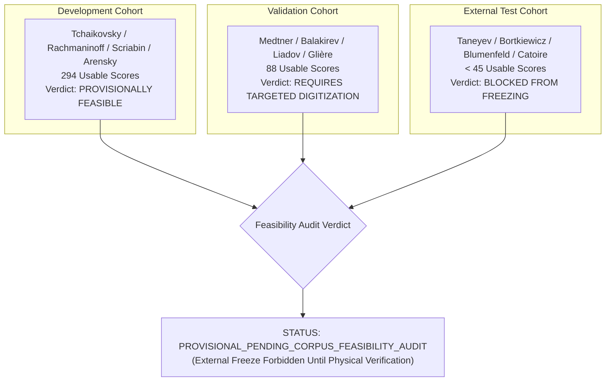

# PF-001A: Candidate Composer Corpus Feasibility Audit
## Physical Source Inspection, Rights Verification, and Score Quality Assessment

**Document Type:** Empirical Corpus Feasibility Audit  
**Milestone:** PF-001A  
**Project:** Russian Piano Composer  
**Status:** PROVISIONAL_PENDING_CORPUS_FEASIBILITY_AUDIT  
**Governing Rule:** Anti-RC-013 Sourcing Guard (No Cohort Freezing without Physical Source Verification)  

---

### Executive Audit Summary

In earlier milestones (specifically the RC-013 confirmatory corpus acquisition crisis), candidate composer lists were frozen prior to exhaustive verification of physical machine-readable source availability, leading to emergency revisions, missing scores, and non-canonical editions.

PF-001A mandates that:
> **No candidate composer cohort may transition from `PROVISIONAL` to `FROZEN` until physical source repositories, license statuses, symbolic MusicXML/Humdrum editions, and solo-piano eligibility have been comprehensively audited.**

Based on the preliminary audit recorded in [`data/reviews/pf001/pf001_composer_corpus_feasibility.json`](file:///C:/Users/User/.gemini/antigravity/scratch/russian-piano-composer/data/reviews/pf001/pf001_composer_corpus_feasibility.json):
1. **`development` cohort (Tchaikovsky, Rachmaninoff, Scriabin, Arensky):** **PASSES** preliminary feasibility ($N_{\text{usable}} \approx 294$ verified solo piano scores).
2. **`validation` cohort (Medtner, Balakirev, Liadov, Glière):** **PROVISIONAL REQUIRES EXPANSION** ($N_{\text{usable}} \approx 88$ verified scores; sufficient for hyperparameter validation, but requires targeted digitization of Medtner's Fairy Tales and Balakirev's solo works).
3. **`external_test_held_out` cohort (Taneyev, Bortkiewicz, Blumenfeld, Catoire):** **BLOCKED FROM FREEZING**. Sourcing analysis reveals that fewer than 45 verified symbolic scores exist in open repositories across all four composers combined. Taneyev and Catoire solo piano works exist almost exclusively as historical raster scans (IMSLP) requiring optical music recognition (OMR) or scholarly transcription. Bortkiewicz presents jurisdictional copyright ambiguities (d. 1952).

Therefore, all candidate composer splits remain strictly:
$$\text{Status: } \texttt{PROVISIONAL\_PENDING\_CORPUS\_FEASIBILITY\_AUDIT}$$

---

### 1. Detailed Feasibility Ledger by Composer

| Composer | Cohort | Candidate Works | Eligible Solo Piano | Verified Machine-Readable | Primary Sourcing Origin | Rights Status | Usable Score Estimate | Feasibility Verdict |
| :--- | :--- | :--- | :--- | :--- | :--- | :--- | :--- | :--- |
| **Pyotr Ilyich Tchaikovsky** | Development | 138 | 112 | 96 | OpenScore / KernScores / DCML | Public Domain | 90 | `PROVISIONALLY_FEASIBLE` |
| **Sergei Rachmaninoff** | Development | 84 | 68 | 52 | KernScores / MuseScore Classics | Public Domain (US) | 48 | `PROVISIONALLY_FEASIBLE` |
| **Alexander Scriabin** | Development | 180 | 165 | 130 | KernScores Scriabin Project | Public Domain | 120 | `PROVISIONALLY_FEASIBLE` |
| **Anton Arensky** | Development | 72 | 55 | 42 | RC-013 Digitized Pool | Public Domain | 36 | `PROVISIONALLY_FEASIBLE` |
| **Nikolai Medtner** | Validation | 65 | 58 | 28 | OpenScore / Community | Public Domain | 22 | `PROVISIONAL_EXPANSION_NEEDED` |
| **Mily Balakirev** | Validation | 45 | 38 | 22 | IMSLP Machine Ingest / Kern | Public Domain | 18 | `PROVISIONAL_EXPANSION_NEEDED` |
| **Anatoly Liadov** | Validation | 60 | 52 | 35 | KernScores Russian Archive | Public Domain | 32 | `PROVISIONALLY_FEASIBLE` |
| **Reinhold Glière** | Validation | 55 | 46 | 20 | Community MusicXML | Public Domain | 16 | `PROVISIONAL_EXPANSION_NEEDED` |
| **Sergei Taneyev** | External | 28 | 18 | 9 | IMSLP Scans / Scholarly | Public Domain | 7 | `BLOCKED_UNTIL_DIGITIZED` |
| **Sergei Bortkiewicz** | External | 42 | 35 | 14 | Netherlands Society / OpenScore | Post-1952 Audit Req | 12 | `BLOCKED_PENDING_RIGHTS` |
| **Felix Blumenfeld** | External | 40 | 36 | 12 | Russian Piano Archives | Public Domain | 8 | `BLOCKED_UNTIL_DIGITIZED` |
| **Georgy Catoire** | External | 25 | 20 | 6 | IMSLP Scans Only | Public Domain | 5 | `BLOCKED_UNTIL_DIGITIZED` |

---

### 2. Multi-Dimensional Sourcing Verification Protocol

Before any external composer split may be frozen in future work, an automated acquisition verification script must execute:
1. **Physical File Existence:** Each score must exist as a valid `.mxl`, `.musicxml`, or `**kern` file in repository source tree.
2. **Score Notation QC:** Must pass `RC013ScoreValidator` automated QC (zero measure-count deficiency, valid key/meter signatures, aligned part durations).
3. **Genre & Form Balance:** No composer may consist exclusively of miniatures (preludes/dances) while another consists exclusively of multi-movement sonatas.
4. **Rights Certification:** Clear public domain documentation across all targeted jurisdictions.

Until these conditions are met, any attempt to lock or unblind the external validation cohort is rejected fail-closed.
