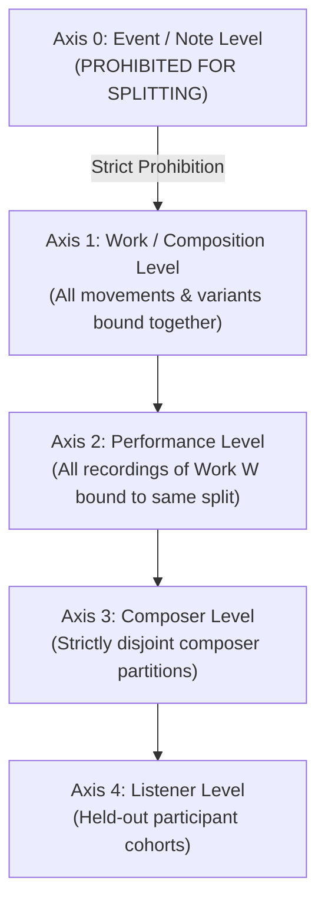
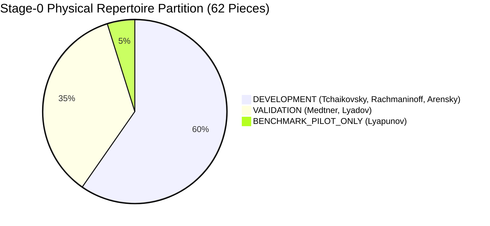

# PF-001: Generalization Hierarchy & Split Policy Specification
## Multi-Axis Data Isolation, Contamination Firewalls, and Validation Criteria

**Document Type:** Research Policy & Split Protocol  
**Milestone:** PF-001C1.2  
**Project:** Russian Piano Composer  
**Status:** STAGE0_SPLIT_MANIFEST_FROZEN  
**Governing Principle:** Zero-Leakage Scientific Isolation & Exact Physical Piece Role Binding  

---

### 1. The Multi-Axis Generalization Hierarchy

Perceptual models in music frequently suffer from subtle data leakage when evaluation splits are constructed via naive random assignment. In symbolic music and audio perception, information leaks across:
1. Contiguous musical phrases within the same movement (thematic recycling, key continuity).
2. Different movements of the same cyclical sonata or suite (motivic mottoes).
3. Alternate arrangements, transcriptions, or revisions of the same work.
4. Multiple recorded performances of the identical score.
5. Stylistic mannerisms and harmonic idioms unique to individual composers.
6. Repeated exposure of the same human listener across experimental sessions.

To eliminate leakage, PF-001 establishes a **Multi-Axis Generalization Hierarchy**:

#### 1.1 Inviolable Isolation Rules
- **Rule 1 (Composition Integrity):** All variants, revisions, movements, and transcriptions of a single work ID must be assigned to the **exact same split**. Random splitting at the measure, note, or segment level is strictly forbidden.
- **Rule 2 (Performance Binding):** Multiple audio performances or MIDI realizations of the same piece must remain within the same split, unless explicitly running a designated performance-generalization control experiment.
- **Rule 3 (Composer-Disjoint Validation):** Confirmatory testing must evaluate compositions from composers who have **zero works** in the development or hyperparameter-tuning splits.
- **Rule 4 (Listener Disjointness):** Listener generalization must be evaluated separately from stimulus generalization. Models must be tested on held-out human listeners to evaluate population-level calibration.

---

### 2. Stage-0 Authoritative Repertoire Partitioning (PF-001C1.2 Frozen)

Before any model parameter is fitted, every physical piece among the 62 verified classical scores is prospectively and immutably assigned to an exact role:

| Partition ID | Role & Allowed Operations | Assigned Composers | Exact Physical Verified Pieces |
| :--- | :--- | :--- | :--- |
| **`DEVELOPMENT`** | Model fitting, self-supervised representation learning, architecture-internal diagnostics, transformation generation ($T_{\text{ID}}$), hard-negative mining, prospective grouped CV calibration. | **Pyotr Ilyich Tchaikovsky** (12) **Sergei Rachmaninoff** (22) **Anton Arensky** (3) | **37 pieces** |
| **`VALIDATION`** | Checkpoint selection, bounded architecture comparison, hyperparameter selection, pilot generalization diagnostics. Must **never** be used for ordinary parameter fitting. | **Nikolai Medtner** (19) **Anatoly Lyadov** (3) | **22 pieces** |
| **`BENCHMARK_PILOT_ONLY`** | Evaluated **exactly once** after architecture/checkpoint freezing as an exploratory sanity check. Must **never** influence training, checkpoint selection, or threshold tuning. NOT an external confirmatory test. | **Sergei Lyapunov** (3) | **3 pieces** |
| **Total Physical Corpus** | Verified machine-readable scores with full dual-hash provenance and canonical parsing. | 6 composers | **62 pieces** |

---

### 3. Contamination Firewalls & Lineage Governance

#### 3.1 External Test Candidate Firewall
- **Cohort:** Sergei Taneyev, Sergei Bortkiewicz, Felix Blumenfeld, Georgy Catoire.
- **Status:** `EXTERNAL_TEST_CANDIDATE_FIREWALLED`.
- **Inviolable Restriction:** No scores, notes, tokens, features, or embeddings may be materialized or inspected during Stage-0 listener development. They remain strictly blinded pending future acquisition and audit.

#### 3.2 Alexander Scriabin Lineage Exclusion
- **Status:** `PREVIOUSLY_EXPOSED_IN_RC012` and `EXCLUDED_FROM_PF_DEVELOPMENT_BY_LINEAGE_POLICY`.
- **Policy:** Because Scriabin was extensively exposed and analyzed in RC-012, Scriabin is excluded from Stage-0 `DEVELOPMENT` and `VALIDATION`, and is `NOT_ELIGIBLE_AS_UNTOUCHED_EXTERNAL_DATA`.

#### 3.3 Future Corpus Expansion Candidates
- **Composers:** Mily Balakirev, Reinhold Glière.
- **Status:** `FUTURE_CORPUS_EXPANSION_CANDIDATE` (0 physically verified scores currently available in repository).
- **Policy:** Excluded from active Stage-0 splits. They may be considered only in future post-PF-002 corpus acquisitions.

### 4. Derivative Inheritance & Split Discipline

1. **Transformation Inheritance Rule:** Any derivative generated from a source piece (including $T_{\text{ID}}$ transforms, counterfactual perturbations, and negative candidates) strictly inherits the source piece role. No transformed derivative may cross split boundaries.
2. **Negative-Pair Split Rule:** Hard-negative construction must never create a pair that leaks a `VALIDATION` or `BENCHMARK_PILOT_ONLY` source into `DEVELOPMENT` training. Both anchor and negative source must originate strictly within `DEVELOPMENT` data.
3. **Model-Selection Sequence:**
   - Fit candidate models only on `DEVELOPMENT`.
   - Internal development diagnostics may use grouped folds within `DEVELOPMENT`.
   - Use `VALIDATION` only for bounded architecture/checkpoint selection.
   - Freeze the final checkpoint before evaluating `BENCHMARK_PILOT_ONLY`.
   - If benchmark results are poor, record the outcome; never tune on Lyapunov and rerun.
4. **Composer-Generalization Scientific Gate:** The `COMPOSER_GENERALIZATION_GATE` remains `NOT_READY_FOR_CALIBRATION`. The Stage-0 split is an exploratory pilot and does not constitute a final external generalization claim.

---

### 5. Multi-Dimensional Scientific Validation Framework

To prevent reductionist optimization of a single composite score, an Artificial Listener must demonstrate certified competence across four orthogonal dimensions:
- `PREDICTIVE_VALIDITY`: Statistical agreement with held-out corpus distributions and human behavioral choice distributions.
- `TEMPORAL_VALIDITY`: Preservation of biological, real-time causal constraints and temporal dynamics of auditory cognition.
- `INTERVENTION_VALIDITY`: Causal responsiveness of the model to controlled structural perturbations (e.g. cadential disruption, chromatic injection).
- `GENERALIZATION_VALIDITY`: Stability of predictive and structural performance when transferred across unseen musical composers.

### 6. Programmatic Split Verification Rules

Every observation and evaluation unit is bound to its parent score split role:
- `development`: Assigned to Tchaikovsky, Rachmaninoff, Arensky.
- `validation`: Assigned to Medtner, Lyadov.
- `external_test_held_out`: Candidate cohort (Taneyev, Bortkiewicz, Blumenfeld, Catoire) strictly firewalled and unmaterialized.
- RC-012 historical cohort is acknowledged and strictly segregated.

