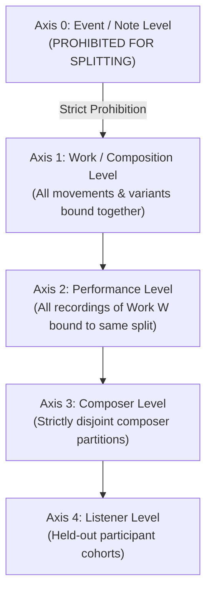
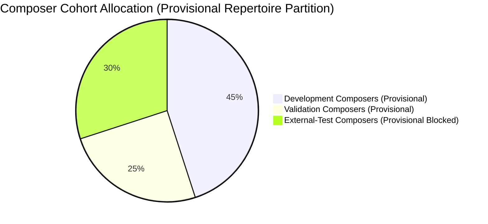
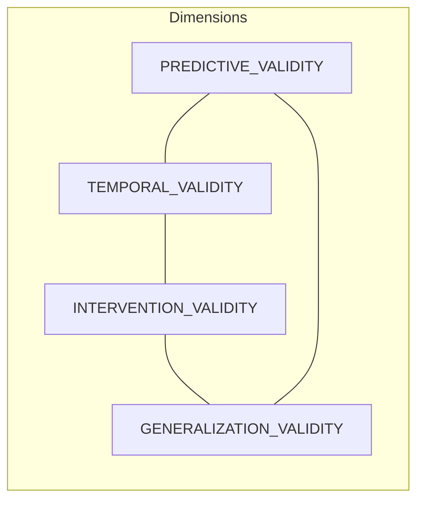

# PF-001: Generalization Hierarchy & Split Policy Specification
## Multi-Axis Data Isolation, Contamination Firewalls, and Validation Criteria

**Document Type:** Research Policy & Split Protocol  
**Milestone:** PF-001  
**Project:** Russian Piano Composer  
**Status:** SPLIT_POLICY_FROZEN_READY_FOR_STAGE0  
**Governing Principle:** Zero-Leakage Scientific Isolation & Composer-Disjoint Validation  

---

### 1. The Multi-Axis Generalization Hierarchy

Perceptual models in music frequently suffer from subtle data leakage when evaluation splits are constructed via naive random assignment. In symbolic music and audio perception, information leaks across:
1. Contiguous musical phrases within the same movement (thematic recycling, key continuity).
2. Different movements of the same cyclical sonata or suite (motivic mottoes).
3. Alternate arrangements, transcriptions, or revisions of the same work.
4. Multiple recorded performances of the identical score.
5. Stylistic mannerisms and harmonic idioms unique to individual composers.
6. Repeated exposure of the same human listener across experimental sessions.

To eliminate leakage, PF-001 establishes a **Multi-Axis Generalization Hierarchy**:

#### 1.1 Inviolable Isolation Rules
- **Rule 1 (Composition Integrity):** All variants, revisions, movements, and transcriptions of a single work ID must be assigned to the **exact same split**. Random splitting at the measure, note, or segment level is strictly forbidden.
- **Rule 2 (Performance Binding):** Multiple audio performances or MIDI realizations of the same piece must remain within the same split, unless explicitly running a designated performance-generalization control experiment.
- **Rule 3 (Composer-Disjoint Validation):** Confirmatory testing must evaluate compositions from composers who have **zero works** in the development or hyperparameter-tuning splits.
- **Rule 4 (Listener Disjointness):** Listener generalization must be evaluated separately from stimulus generalization. Models must be tested on held-out human listeners to evaluate population-level calibration.

---

### 2. Standardized Composer Partitioning (Provisional Status)

To ensure scientific replicability and prevent repeating the RC-013 mistake of premature cohort freezing, all candidate composer partitions are designated **`PROVISIONAL_PENDING_CORPUS_FEASIBILITY_AUDIT`**:

| Partition ID | Role & Purpose | Assigned Composers | Cohort Status & Feasibility Requirement |
| :--- | :--- | :--- | :--- |
| **`development`** | Feature extraction, exploratory modeling, baseline listener calibration | **Pyotr Ilyich Tchaikovsky** **Sergei Rachmaninoff** **Alexander Scriabin** **Anton Arensky** | `PROVISIONAL_PENDING_CORPUS_FEASIBILITY_AUDIT` (Passes preliminary feasibility with ~294 usable scores). |
| **`validation`** | Hyperparameter selection, checkpoint selection, prompt tuning | **Nikolai Medtner** **Mily Balakirev** **Anatoly Liadov** **Reinhold Glière** | `PROVISIONAL_PENDING_CORPUS_FEASIBILITY_AUDIT` (Requires targeted expansion for Medtner/Balakirev). |
| **`external_test_held_out`** | **Strict Confirmatory Test** (Untouched during model design) | **Sergei Taneyev** **Sergei Bortkiewicz** **Felix Blumenfeld** **Georgy Catoire** | `PROVISIONAL_PENDING_CORPUS_FEASIBILITY_AUDIT` **BLOCKED FROM FREEZING** (< 45 verified symbolic scores available; requires physical score acquisition). |

#### 2.1 The Untouched External Test Rule & Feasibility Gate
The four composers in `external_test_held_out` represent an unbreached evaluation horizon. However, in accordance with PF-001A:
- **No external composer split may become FROZEN until physical machine-readable source availability, rights, format validity, and solo-piano eligibility are verified.**
- Freezing an external cohort prematurely without confirmed physical score assets is strictly forbidden.
- During model design, architecture exploration, and parameter fitting, the external test set remains behind an air-gapped firewall.

---

### 3. RC-012 Confirmatory Cohort Data Contamination Rule

In milestone RC-012, an authoritative 483-piece corpus (comprising Rubinstein, Prokofiev, and 7 control composers) was unblinded and evaluated in a one-shot statistical test:
$$\text{Status: COMPLETED\_AUTHORITATIVE (Hash: a933ac2b21fe50cff9c0a43e8216ee37593acded32e22ecb0e9502b231cffded)}$$

#### 3.1 Contamination Invariant
Because the RC-012 dataset and its feature representations have already been inspected, published, and analyzed in repository records:
1. **No Untouched Status Claim:** The 483 pieces in the RC-012 cohort can **never** be presented as an unblinded, untouched external confirmation set for PF-001 or any subsequent Perception-First model.
2. **Permitted Usage:** The RC-012 corpus may be utilized only as:
   - Historical baseline evidence.
   - Exploratory / development source repertoire (with full disclosure).
   - Sanity-check benchmark for symbolic parsing pipelines.
3. **Artifact Immutability:** All RC-012 artifacts in `data/reviews/rc012/` and `docs/research/RC012*` must remain completely unmodified and preserved in the repository commit tree.

---

### 4. Four Independent Validation Dimensions

To prevent reductionist optimization of a single composite score, an Artificial Listener must demonstrate certified competence across four orthogonal dimensions:
- `PREDICTIVE_VALIDITY`
- `TEMPORAL_VALIDITY`
- `INTERVENTION_VALIDITY`
- `GENERALIZATION_VALIDITY`

#### 4.1 Dimension 1: Predictive Validity (`PREDICTIVE_VALIDITY`)
* **Definition:** Statistical agreement between the model's conditional predictive distributions and empirical human behavioral choice distributions on unseen musical contexts.
* **Mandatory Evidentiary Criteria:**
  - $\text{JSD}(P_{\text{AI}} \parallel P_{\text{human}}) \le \text{JSD}_{\text{ceil, upper}}$ across $N \ge 100$ evaluation contexts.
  - Multi-candidate probability rank-order Spearman correlation $\rho \ge 0.70$ ($p < 0.001$).
  - Expected Calibration Error (ECE) $\le 0.08$ on continuation confidence.

#### 4.2 Dimension 2: Temporal Validity
* **Definition:** Preservation of biological, real-time causal constraints and alignment with the temporal dynamics of human auditory cognition.
* **Mandatory Evidentiary Criteria:**
  - **Strict Non-Anticipation:** Output at time $t$ must depend strictly on context $\le t$. Any bidirectional or lookahead architecture without causal masking is disqualified.
  - **Cognitive Latency Alignment:** Dynamic shifts in model uncertainty ($-\frac{d}{dt} H_{\text{AI}}$) must correlate with human reaction time curves with an empirical lag $200 \le \tau_{\text{lag}} \le 1000\text{ ms}$.
  - **Timescale Separation:** Event-level updates (< 500 ms) must remain computationally distinct from phrase-level closure integration (> 4000 ms).

#### 4.3 Dimension 3: Intervention Validity
* **Definition:** Causal responsiveness of the model to controlled structural perturbations in the musical stimulus.
* **Mandatory Evidentiary Criteria:**
  - Directional sign concordance:
    $$\text{Sign}\left(\Delta \text{Metric}_{\text{AI}}\right) = \text{Sign}\left(\Delta \text{Metric}_{\text{human}}\right) \quad \text{in } \ge 90\% \text{ of standardized perturbation trials}.$$
  - Cadence disruption test: Moving a cadential resolution from a strong metric downbeat to a weak beat must decrease model closure probability $C_{\text{AI}}$ by $\ge 0.50$.
  - Tritone substitution test: Injecting an out-of-key foreign root must increase model surprisal by $\ge 3.0\text{ bits}$.

#### 4.4 Dimension 4: Generalization Validity
* **Definition:** Stability of predictive performance when transferred across unseen musical composers and new listener demographics.
* **Mandatory Evidentiary Criteria:**
  - **Composer Transfer:** Predictive divergence increase on `external_test_held_out` relative to `validation` must not exceed $15\%$:
    $$\frac{\text{JSD}_{\text{external}} - \text{JSD}_{\text{val}}}{\text{JSD}_{\text{val}}} \le 0.15$$
  - **Listener Cohort Transfer:** Model predictions must replicate across non-expert and expert listener sub-cohorts after adjusting for musical training covariates.

---

### 5. Summary Protocol for Split Assignment Verification

Every dataset entry generated under PF-001 must contain an explicit `split_id` attribute governed by the following programmatic rule:

$$\text{split\_id} = \begin{cases}
\text{"development"}, & \text{if } \text{composer} \in \{\text{Tchaikovsky, Rachmaninoff, Scriabin, Arensky}\} \\
\text{"validation"}, & \text{if } \text{composer} \in \{\text{Medtner, Balakirev, Liadov, Glière}\} \\
\text{"external_test_held_out"}, & \text{if } \text{composer} \in \{\text{Taneyev, Bortkiewicz, Blumenfeld, Catoire}\} \\
\text{ERROR\_QUARANTINE}, & \text{otherwise}
\end{cases}$$

No observation record labeled with `external_test_held_out` may be unblinded during any preliminary exploratory phase.
