# PF-001: Measurement Dependency Graph & Construct Precedence
## Formal Directed Acyclic Graph (DAG) for Perceptual Construct Operationalization

**Document Type:** Measurement Dependency Architecture  
**Milestone:** PF-001  
**Project:** Russian Piano Composer  
**Status:** DEPENDENCY_GRAPH_FROZEN  
**Governing Rule:** Strict Upstream Construct Precedence (Fail-Closed Propagation)  

---

### 1. Conceptual Rationale & The Upstream Gating Invariant

In complex cognitive systems, higher-order perceptual experiences (such as the perception of dramatic narrative, thematic fertility, or structural tension) are not autonomous, isolated sensations. They are mathematically and psychologically built upon lower-level sensory and cognitive mechanisms.

Attempting to model or optimize a higher-order construct (e.g. *Narrative Coherence* or *Tension*) while its foundational components (e.g. *Expectation*, *Closure*, and *Theme Memory*) remain unvalidated creates illusory correlations and spurious optimization.

#### 1.1 The Upstream Gating Invariant
$$\text{Status}(C_{\text{target}}) = \text{VERIFIED} \iff \forall C_{\text{parent}} \in \text{Parents}(C_{\text{target}}), \quad \text{Status}(C_{\text{parent}}) = \text{VERIFIED}$$

If any parent construct is `LATENT_NEEDS_VALIDATION`, `MEASUREMENT_DEFINITION_OPEN`, or `REJECTED_AS_DIRECT_SCALAR`, the downstream target construct **cannot** be verified, nor may it be used as an objective function in composer training.

---

### 2. Complete Measurement Dependency Directed Acyclic Graph (DAG)

```mermaid
graph TD
    %% Stimulus Level
    subgraph S0["Raw Stimulus & Context Infrastructure"]
        CTX["Musical Context & Token Stream<br/>(Score / MIDI / Performance)"]
        THM["Theme & Motif Definition<br/>(Canonical Thematic Identity)"]
        TRF["Transformation Battery<br/>(Systematic Morphological Ops)"]
    end

    %% Stage-0 Perceptual Primitives
    subgraph STAGE0["Stage-0 Approved Perceptual Primitives (MEASURABLE_NOW)"]
        EXP["Expectation E(t)<br/>P_human(x_next | context)"]
        SUR["Surprise S(t)<br/>-log2 P_AI(x_t | context)"]
        UNC["Uncertainty U(t)<br/>H(P(x | context)) + Hesitation"]
        CLO["Closure Expectation C(t)<br/>P(termination | context)"]
        REC["Theme Recognition R(M, M_i)<br/>Discrimination & Latency"]
        MEM["Tripartite Memory M(t)<br/>[Recognition d', Recall, Familiarity]"]
    end

    %% Intermediate Latent Constructs
    subgraph STAGE1["Stage-1 Intermediate Latent Constructs (LATENT_NEEDS_VALIDATION)"]
        TFR["Theme Fertility T_R<br/>Admissible Transformation Manifold"]
        TEN["Tension Trajectory T(t)<br/>Continuous Dynamic Strain"]
        PBR["Phrase Breath<br/>Microtiming Dilation & Punctuation"]
        AAR["Auditory Attention Routing<br/>Polyphonic Stream Allocation"]
        CNN["Counterfactual Necessity<br/>6D Perceptual Deficit Vector"]
    end

    %% Higher-Order Perceptual Syntheses
    subgraph STAGE2["Stage-2 Higher-Order Syntheses (LATENT_NEEDS_VALIDATION)"]
        SMR["Semantic Reinterpretation<br/>Retrospective Harmonic Pivot"]
        RTM["Retrospective Meaning<br/>Formal Teleological Realization"]
        EMC["Emotional Causality<br/>Organic Affective Preparation"]
        AFC["Affective Counterpoint<br/>Bivariate Valence Grid"]
        ACI["Acoustic Intent<br/>Attributed Expressive Agency"]
        DPR["Delayed Preference<br/>48h Incubation Aesthetic Choice"]
        NRC["Narrative Coherence<br/>Macro-Formal Milestone Arc"]
    end

    %% Emergent Apex & Excluded Concepts
    subgraph APEX["Emergent Perceptual Apex (NON-SCALAR)"]
        LET["Listener Experience Trajectory (LET)<br/>Multivariate Perceptual Manifold"]
        MMN["Musical Meaning<br/>(HIGH_LEVEL_NOT_OPERATIONAL)"]
        OMQ["Overall Musical Quality<br/>(REJECTED_AS_DIRECT_SCALAR)"]
    end

    %% Dependencies: Stimulus to Stage-0
    CTX --> EXP
    CTX --> CLO
    THM --> REC
    CTX & THM --> MEM

    %% Internal Stage-0 Derivations
    EXP -->|Negative Log-Likelihood| SUR
    EXP -->|Response Dispersion / Entropy| UNC

    %% Stage-0 to Stage-1 Dependencies
    REC & TRF -->|Transformation Coverage| TFR
    EXP & CLO & MEM -->|Expectation Violations & Resolution Delay| TEN
    CLO & TEN -->|Cadential Punctuation & Relaxation| PBR
    UNC & SUR & MEM -->|Salience & Novelty Allocation| AAR
    EXP & REC & CLO & TEN -->|Multi-Dimensional Deficit Vector| CNN

    %% Stage-1 to Stage-2 Dependencies
    SUR & TEN & AAR -->|Harmonic Re-framing at Pivot| SMR
    MEM & SMR & NRC -->|Formal Recapitulation Resolution| RTM
    TEN & SMR & PBR -->|Earned Transition Mechanics| EMC
    AAR & TEN -->|Concurrent Stream Valence Divergence| AFC
    PBR & AAR & CNN -->|Micro-Nuance Deliberation Attribution| ACI
    MEM & EMC & TEN -->|Longitudinal Consolidation & Re-listening| DPR
    SMR & RTM & EMC & AFC -->|Global Dramaturgical Architecture| NRC

    %% Apex Syntheses
    EXP & UNC & SUR & CLO & REC & MEM & TEN & NRC -->|Validated Perceptual State Vector| LET
    LET -.->|Emergent Hermeneutic Synthesis| MMN
    LET -.->|Non-Scalar Multi-Criterion Appraisal| OMQ

    %% Styling
    classDef approved fill:#e8f5e9,stroke:#2e7d32,stroke-width:2px;
    classDef latent fill:#fff3e0,stroke:#ef6c00,stroke-width:2px;
    classDef rejected fill:#ffebee,stroke:#c62828,stroke-width:2px,stroke-dasharray: 5 5;
    classDef infra fill:#e1f5fe,stroke:#0277bd,stroke-width:2px;

    class EXP,SUR,UNC,CLO,REC,MEM approved;
    class TFR,TEN,PBR,AAR,CNN,SMR,RTM,EMC,AFC,ACI,DPR,NRC latent;
    class MMN,OMQ rejected;
    class CTX,THM,TRF infra;
```

---

### 3. Mathematical Specifications of Dependency Edges

#### 3.1 Expectation $\to$ Surprise
Surprise is an exact derived quantity of the conditional predictive probability of the realized musical token $x_t$:
$$S(t) = -\log_2 P_{\text{AI}}(x_t \mid x_{<t})$$
*Gating Invariant:* Model surprise cannot be evaluated if predictive probabilities $P_{\text{AI}}$ fail calibration checks.

#### 3.2 Expectation $+$ Choice Dispersion $\to$ Uncertainty
Predictive uncertainty is the informational entropy across the full probability distribution:
$$U(t) = -\sum_{x \in \mathcal{X}} P_{\text{AI}}(x \mid x_{<t}) \log_2 P_{\text{AI}}(x \mid x_{<t})$$
*Gating Invariant:* High uncertainty with low entropy is mathematically impossible. Uncertainty tracks the spread of $P$, not the failure of the model.

#### 3.3 Theme Identity $\to$ Recognition $\to$ Memory
1. A musical theme $M$ establishes an initial memory trace upon first exposure ($M(t_0)$).
2. Presentation of a transformed variant $M_i$ evokes recognition $R(M, M_i)$, which activates episodic retrieval:
   $$\text{Hit Probability } P(\text{Hit} \mid \tau) = f(R(M, M_i), M(\tau))$$
*Gating Invariant:* Theme memory sensitivity $d'$ cannot be measured without validated control over baseline theme recognizability $R$.

#### 3.4 Recognition $+$ Transformation Space $\to$ Theme Fertility
Theme Fertility $T_R(M; \theta)$ measures the volume of the transformation manifold for which human recognition exceeds threshold $\theta$:
$$T_R(M; \theta) = \left\{ M_i \in \mathcal{T}(M) : R(M, M_i) \ge \theta \right\}$$
$$\text{Fertility}(M) = \mu\left( T_R(M; \theta) \right)$$
*Gating Invariant:* Fertility cannot be computed without empirical validation of recognition metric $R$ across all transformation operators $\mathcal{T}$.

#### 3.5 Expectation $+$ Closure $+$ Memory $\to$ Tension
Tension $T(t)$ integrates multiple lower-level processes over time:
$$T(t) = w_E \int_0^t e^{-\frac{t-s}{\tau_E}} \text{ExpectationViolation}(s) \, ds + w_C (1 - C(t)) + w_M \text{TonalDistance}(t, M_{\text{tonic}})$$
*Gating Invariant:* Modeling dynamic musical tension without validated expectation $E(t)$ and closure $C(t)$ produces ungrounded heuristics.

#### 3.6 Validated Low-Level Primitives $\to$ Listener Experience Trajectory (LET)
The Listener Experience Trajectory is the time-varying state vector across validated perceptual dimensions:
$$\mathbf{LET}(t) = \begin{bmatrix}
E(t) \\
U(t) \\
S(t) \\
C(t) \\
R(t) \\
M(t) \\
T(t)
\end{bmatrix} \in \mathbb{R}^7$$

---

### 4. Stage Progression Rules & Verification Gating Matrix

| Source Stage | Target Stage | Prerequisites for Gate Transition | Fail-Closed Block Condition |
| :--- | :--- | :--- | :--- |
| **Stage 0** (Primitives) | **Stage 1** (Intermediate) | EXP-001 through EXP-005 protocols pass noise ceiling checks on `development` cohort. | If JSD of expectation exceeds noise ceiling, all Stage-1 models are blocked. |
| **Stage 1** (Intermediate) | **Stage 2** (Macro-Form) | Tension dial, Fertility manifold, and 6D Counterfactual vector achieve validated status. | If Theme Fertility cannot be separated from stylistic familiarity, macro-narrative is blocked. |
| **Stage 2** (Syntheses) | **LET Apex** | All component trajectories replicate on `external_test_held_out` with zero leakage. | If external composer transfer fails, LET optimization in Composer is prohibited. |

By enforcing this dependency graph, the project prevents any premature construction of a "Composer Critic" before its perceptual foundation has been empirically verified.
