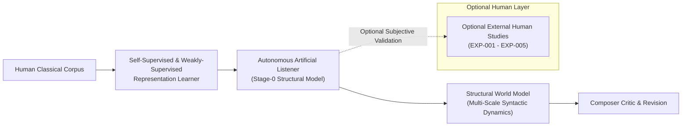
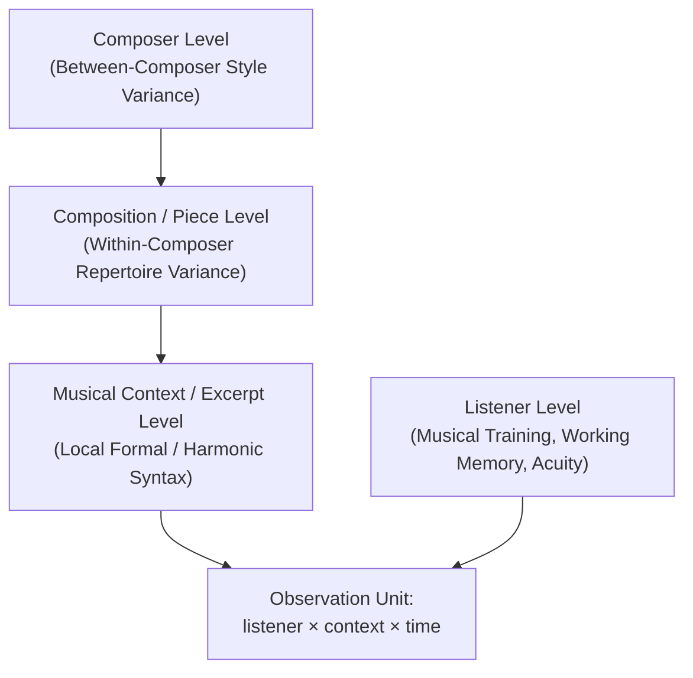
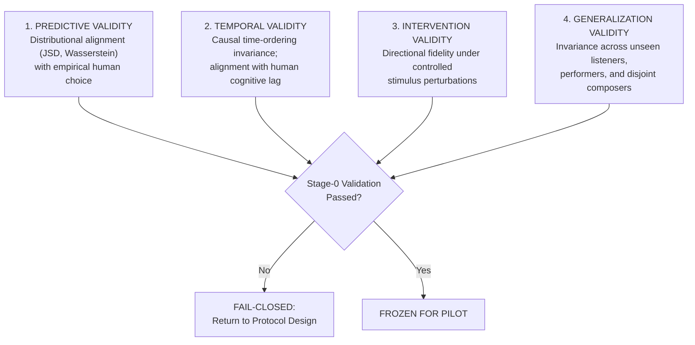

# PF-001 / PF-001A: Perception-First Artificial Listener
## Construct Operationalization & Autonomous Measurement Contract Report

**Authoritative Scientific Lineage:** Russian Piano Composer Project  
**Milestone:** PF-001A (Autonomous Structural Learning Contract)  
**Status:** AUTONOMOUS_CONTRACT_FROZEN_READY_FOR_CORPUS_FEASIBILITY  
**Branch:** `pf/001-listener-measurement-operationalization`  
**Governing Standard:** Corpus-Observable Structural Supervision & Multi-Scale Representation Learning  

---

### Executive Summary & Governing Scientific Inversion

Traditional symbolic music generation systems optimize language-modeling objectives over note sequences:
$$\min_\theta \mathbb{E}\left[-\log P_\theta(x_{t} \mid x_{<t})\right]$$
While statistical fluency over token n-grams can produce local stylistic coherence, optimizing next-token cross-entropy alone does not construct, represent, or track **musical experience**. A system trained solely to maximize symbolic likelihood lacks an internal model of structural expectation, closure, and motivic memory.

The **Perception-First Classical Composition** paradigm establishes that:
1. Music composition is fundamentally the intentional shaping of a dynamic **Listener Experience Trajectory (LET)** across time:
   $$\mathbf{LET}(t) = \left[ E_s(t), U_s(t), S_s(t), C_s(t), R_m(t), M_s(t), T_s(t), \dots \right]^T$$
2. Under PF-001A, **human participant judgments are NOT a prerequisite for building or gating Stage-0**. The primary teacher is the **corpus of human-composed classical music itself**.
3. The governing architectural flow is:
   $$\text{HUMAN CLASSICAL CORPUS} \longrightarrow \text{SELF-SUPERVISED LEARNER} \longrightarrow \text{ARTIFICIAL LISTENER}$$
   $$\longrightarrow \text{STRUCTURAL WORLD MODEL} \longrightarrow \text{COMPOSER} \longrightarrow \text{COUNTERFACTUAL CRITIC} \longrightarrow \text{REVISION}$$
4. Human listening studies are preserved as an **`OPTIONAL_EXTERNAL_VALIDATION`** layer. They are mandatory only when asserting an explicit empirical claim about human subjective perception (e.g. *"human listeners perceive this passage as tense"*).

Internal variables in Stage-0 are strictly designated as **structural constructs**:
- $E_s(t) = \text{Structural Expectation}$
- $U_s(t) = \text{Structural Uncertainty}$
- $S_s(t) = \text{Structural Surprise}$
- $C_s(t) = \text{Structural Closure}$
- $R_m(t) = \text{Motif Identity / Contrastive Recognition}$
- $M_s(t) = \text{Long-Range Structural Memory Trace}$

---

### 1. Stage-0 Artificial Listener Scope Freeze

To prevent premature architectural overreach, Stage-0 is strictly restricted to five foundational perceptual primitives and their direct mathematical derivatives:

| Primitive | Mathematical Notation | Implementation Namespace | Stage-0 Model Output Target | Empirical Human Benchmark |
| :--- | :--- | :--- | :--- | :--- |
| **Expectation** | $E(t) = P(x_{t+1} \mid x_{\le t})$ | `expectation` | `model_prediction_distribution` | `human_continuation_distribution` |
| **Uncertainty** | $U(t) = H(P(x_{t+1} \mid x_{\le t}))$ | `uncertainty` | `model_uncertainty` | Response Entropy & Inverted Confidence ($1 - \text{conf}$) |
| **Surprise** | $S(t) = -\log_2 P(x_t \mid x_{<t})$ | `expectation.derived_surprise` | `model_surprise` | Graded Unexpectedness Likert & Latency Peak |
| **Closure** | $C(t) = P(\text{term} \mid x_{\le t})$ | `closure` | `model_closure_probability` | `human_closure_rating` (Completeness Probe) |
| **Recognition** | $R(t) = P(\text{same theme} \mid M, M_i)$ | `recognition` | `model_recognition_score` | Graded Theme Discrimination, RT, Confidence |
| **Memory** | $M(t) = [M_{\text{rec}}, M_{\text{rcl}}, M_{\text{fam}}]$ | `memory` | Activation & Token Generation | Signal Detection $d'$, Recall Edit Distance, Familiarity |

**Strict Exclusion Rule:** Stage-0 explicitly prohibits modeling or computing narrative coherence, global musical quality, emotional causality, retrospective meaning, or semantic reinterpretation. These higher-order constructs are classified as `LATENT_NEEDS_VALIDATION` or `HIGH_LEVEL_NOT_OPERATIONAL`.

---

### 2. Rigorous Operationalization of Core Constructs

#### 2.1 Expectation ($E(t)$)
* **Conceptual Definition:** The listener's conditional predictive probability distribution over immediate subsequent musical events (pitches, onsets, durations, harmonies) given the accumulated musical context.
* **Human Target:** $P_{\text{human}}(x_{t+1} \mid x_{\le t})$.
* **Human Observable:** Empirical choice probability distribution over candidate continuations elicited via K-alternative forced choice continuation tasks or multi-point probability distribution allocation, combined with subjective continuation confidence.
* **Model Target:** $P_{\text{AI}}(x_{t+1} \mid x_{\le t})$.
* **Prospective Validation Metrics:**
  - Distributional divergence: Jensen-Shannon Divergence:
    $$\text{JSD}(P_{\text{human}} \parallel P_{\text{AI}}) = \frac{1}{2} D_{\text{KL}}\left(P_{\text{human}} \parallel \frac{P_{\text{human}} + P_{\text{AI}}}{2}\right) + \frac{1}{2} D_{\text{KL}}\left(P_{\text{AI}} \parallel \frac{P_{\text{human}} + P_{\text{AI}}}{2}\right)$$
  - Pitch-space Earth Mover's Distance (Wasserstein metric accounting for tonal circle-of-fifths distance).
  - Multi-class Brier Score and candidate rank-order correlation (Spearman's $\rho$).
* **Methodological Invariant:** Top-1 prediction accuracy is **insufficient**. An Artificial Listener that assigns 99% probability to the correct note when human listeners are equally split across three plausible continuations is systematically miscalibrated.

#### 2.2 Uncertainty ($U(t)$)
* **Conceptual Definition:** The informational entropy or dispersion of the listener's expectation distribution over future musical states, reflecting subjective doubt and structural ambiguity.
* **Human Observable:** Empirical Shannon entropy of aggregate human continuation choices:
  $$H_{\text{human}}(x_{\le t}) = -\sum_{k} P_{\text{human}}(x_{k} \mid x_{\le t}) \log_2 P_{\text{human}}(x_{k} \mid x_{\le t})$$
  paired with individual subjective uncertainty ($1 - \text{confidence}$) and response latency (hesitation time).
* **Model Target:**
  $$H_{\text{AI}}(x_{\le t}) = -\sum_{x} P_{\text{AI}}(x \mid x_{\le t}) \log_2 P_{\text{AI}}(x \mid x_{\le t})$$
* **Methodological Invariant:** Expectation and Uncertainty must remain separate constructs. Expectation represents the specific probability vector over continuation states; Uncertainty represents the dispersion across that vector.

#### 2.3 Closure Expectation ($C(t)$)
* **Conceptual Definition:** The subjective probability that the musical context can terminate naturally, stably, and syntactically at time $t$, versus demanding immediate structural continuation.
* **Human Observable:** Proportion of listeners judging that a phrase can terminate naturally at probe point $t$:
  $$C_{\text{human}}(t) = P(\text{listener judges context can terminate naturally at } t)$$
  elicited via probe truncation trials ("Could this phrase naturally end here?").
* **Model Target:** $C_{\text{AI}}(t) = P_{\text{AI}}(\text{termination} \mid x_{\le t}) \in [0, 1]$.
* **Methodological Invariant:** Closure is **not** equal to low tension. A peaceful, harmonically open modal transition may have low tension but zero closure; an authentic cadence preceding an unresolved pause has maximal closure. Equating closure with inverted tension is scientifically invalid.

#### 2.4 Theme Recognition ($R(M, M_i)$)
* **Conceptual Definition:** The cognitive mapping process whereby a transformed phrase $M_i$ is recognized as an instance of an underlying theme $M$.
* **Human Observable:** Proportion of listeners identifying $M_i$ as identical or derived from $M$ in a 2AFC or graded 6-point discrimination task, recorded alongside response latency (ms) and decision confidence.
* **Model Target:** $R_{\text{AI}}(M, M_i) \in [0, 1]$.
* **Methodological Invariant:** AI similarity metric must be explicitly validated against empirical human recognition decay under controlled transformations (rhythmic diminution, inversion, retrograde, harmonic recontextualization), rather than relying on uncalibrated cosine distances in embedding space.

#### 2.5 Tripartite Musical Memory ($M(t)$)
Memory must not be treated as a single monolithic decay variable. It is decomposed into three independent empirical constructs:
1. **Recognition Memory ($M_{\text{rec}}$):** Signal detection sensitivity ($d'$) discriminating previously heard motifs from unexposed foils across retention delays $\Delta t$:
   $$d' = \Phi^{-1}(\text{Hit Rate}) - \Phi^{-1}(\text{False Alarm Rate})$$
2. **Recall Memory ($M_{\text{recall}}$):** Active symbolic reconstruction fidelity. Probed by providing a 1-measure retrieval cue and recording hummed, sung, or MIDI-transcribed continuation. Evaluated via normalized Levenshtein pitch distance and contour alignment.
3. **Familiarity ($M_{\text{fam}}$):** Graded subjective feeling of knowing (1-7 Likert) without episodic recollection of original context.
* **Methodological Invariant:** An exponential memory decay law ($e^{-\lambda t}$) must **not** be assumed a priori. The functional decay form (power-law, hyperbolic, exponential, or interference-based) must be empirically determined from human retention data.

---

### 3. Advanced Perceptual Constructs & Formal Operationalization

#### 3.1 Theme Fertility ($T_R$)
* **Conceptual Definition:** The morphological generative breadth of a theme, defined as the volume, diversity, and coverage of its recognizable transformation space.
* **Operationalization:** Let $T(M) = \{M_1, M_2, \dots, M_K\}$ denote a prospectively standardized battery of morphological transformations (inversion, diminution, augmentation, chromatic mutation, accompaniment stripping, metric displacement).
* **Admissible Set:**
  $$T_R(M; \theta) = \left\{ M_i \in T(M) : R_{\text{human}}(M, M_i) \ge \theta \right\}$$
  where $\theta$ is a recognition threshold frozen prior to confirmatory testing.
* **Fertility Metric:** Represented as the convex hull volume, dispersion, and entropy of $T_R$ in transformation attribute space.
* **Methodological Invariant:** Theme Fertility must **not** be collapsed into an arbitrary scalar score or optimized automatically in Stage-0.

#### 3.2 Counterfactual Note Necessity as a Vector
Generic scalar "note importance" is rejected. For any note or chord $n$, counterfactual intervention $\delta$ produces a 6-dimensional perceptual deficit vector:
$$\Delta \mathbf{V}(n, \delta) = \begin{bmatrix}
\Delta E(n) \\
\Delta R(n) \\
\Delta T(n) \\
\Delta C(n) \\
\Delta A(n) \\
\Delta K(n)
\end{bmatrix} = \begin{bmatrix}
\text{Shift in continuation expectation} \\
\text{Drop in motif recognition} \\
\text{Disruption of harmonic tension curve} \\
\text{Premature or delayed closure effect} \\
\text{Attentional misrouting} \\
\text{Acoustic clarity / voice-leading roughness}
\end{bmatrix}$$
Standardized interventions include:
1. Note deletion
2. Pitch substitution (chromatic step, tritone substitute, diatonic neighbor)
3. Duration perturbation (halving, doubling)
4. Onset shift (anticipation, syncopation delay)
5. Register shift (octave displacement)

---

### 4. Classification & Status of All 24 Constructs

| Construct Name | Construct ID | Timescale | Measurement Class | Current Status | Stage-0 Scope |
| :--- | :--- | :--- | :--- | :--- | :--- |
| **Expectation** | `CST-EXP-001` | event_level | behavioral_continuation_distribution | `MEASURABLE_NOW` | YES (`expectation`) |
| **Uncertainty** | `CST-UNC-001` | event_to_phrase | response_distribution_dispersion | `MEASURABLE_NOW` | YES (`uncertainty`) |
| **Surprise** | `CST-SUR-001` | event_level | derived_information_salience | `MEASURABLE_NOW` | YES (`derived_surprise`) |
| **Closure Expectation** | `CST-CLO-001` | phrase_to_section | continuous_rating_boundary_detection | `MEASURABLE_NOW` | YES (`closure`) |
| **Theme Recognition** | `CST-REC-001` | motif_to_phrase | binary_graded_theme_discrimination | `MEASURABLE_NOW` | YES (`recognition`) |
| **Recognition Memory** | `CST-MEM-REC-001` | section_to_piece | signal_detection_discrimination | `MEASURABLE_NOW` | YES (`memory`) |
| **Recall Memory** | `CST-MEM-RCL-001` | phrase_to_piece | active_reconstruction_fidelity | `MEASURABLE_NOW` | YES (`memory`) |
| **Familiarity** | `CST-MEM-FAM-001` | phrase_to_piece | subjective_graded_familiarity_scale | `MEASURABLE_NOW` | YES (`memory`) |
| **Theme Fertility** | `CST-TFR-001` | piece_level | transformation_space_admissibility | `LATENT_NEEDS_VALIDATION` | NO |
| **Tension** | `CST-TEN-001` | continuous_trajectory | continuous_dial_rating | `LATENT_NEEDS_VALIDATION` | NO |
| **Delayed Preference** | `CST-DPR-001` | multi_day_longitudinal | paired_longitudinal_aesthetic_choice | `LATENT_NEEDS_VALIDATION` | NO |
| **Counterfactual Note Necessity** | `CST-CNN-001` | event_level | vector_perturbation_sensitivity | `LATENT_NEEDS_VALIDATION` | NO |
| **Phrase Breath** | `CST-PBR-001` | phrase_boundary | temporal_boundary_microtiming | `LATENT_NEEDS_VALIDATION` | NO |
| **Auditory Attention Routing** | `CST-AAR-001` | polyphonic_layer | selective_stream_auditory_probe | `LATENT_NEEDS_VALIDATION` | NO |
| **Semantic Reinterpretation** | `CST-SMR-001` | phrase_to_section | retrospective_role_reassignment | `LATENT_NEEDS_VALIDATION` | NO |
| **Retrospective Meaning** | `CST-RTM-001` | multi_section | retrospective_coherence_evaluation | `LATENT_NEEDS_VALIDATION` | NO |
| **Emotional Causality** | `CST-EMC-001` | transition_level | affective_transition_plausibility | `LATENT_NEEDS_VALIDATION` | NO |
| **Acoustic Intent** | `CST-ACI-001` | gesture_level | intentionality_attribution_rating | `LATENT_NEEDS_VALIDATION` | NO |
| **Affective Counterpoint** | `CST-AFC-001` | phrase_level | bivariate_affective_grid_rating | `LATENT_NEEDS_VALIDATION` | NO |
| **Narrative Coherence** | `CST-NRC-001` | piece_to_work | retrospective_narrative_mapping | `LATENT_NEEDS_VALIDATION` | NO |
| **Musical Meaning** | `CST-MMN-001` | piece_and_cultural | open_hermeneutic_discourse | `HIGH_LEVEL_NOT_OPERATIONAL` | NO |
| **Overall Musical Quality** | `CST-OMQ-001` | piece_level | unidimensional_scalar_judgment | `REJECTED_AS_DIRECT_SCALAR` | NO |
| **Emotional Depth** | `CST-EMD-001` | piece_level | subjective_holistic_valuation | `HIGH_LEVEL_NOT_OPERATIONAL` | NO |
| **Narrative Depth** | `CST-NRD-001` | piece_level | subjective_holistic_valuation | `HIGH_LEVEL_NOT_OPERATIONAL` | NO |

---

### 5. Explicit Rejection of High-Level Direct Scalarization

In alignment with psychometric and musicological principles, the following four concepts are explicitly rejected as direct numeric scalar optimization targets:
1. **Overall Musical Quality:** Quality is a multi-dimensional, socio-cultural, and highly contextual emergent phenomenon. Formulating a scalar $Q \in \mathbb{R}$ incentivizes reward-hacking of superficial heuristics (e.g. overt harmonic density or repetitive sensory consonant patterns) that ruin artistic depth.
2. **Musical Meaning:** Meaning arises from hermeneutic, historical, and semiotic relations between musical structures and human culture. It cannot be reduced to an internal token score.
3. **Emotional Depth:** Depth reflects multi-layered, often conflicting affective valences and existential resonance; compressing it into a scalar destroys affective counterpoint.
4. **Narrative Depth:** Narrative arises from long-range formal drama and thematic transformation across full works; it cannot be optimized as a localized reward signal.

These constructs may only be evaluated as emergent properties of validated lower-level constructs once Stage-0 and Stage-1 verification gates are fully passed.

---

### 6. The Primary Observation Unit & Hierarchical Dependency Structure

In traditional machine learning, the observation unit is typically the `piece` or the `token`. In human perceptual science, this creates severe aggregation bias.

The primary observation unit in PF-001 is formally defined as:
$$\mathbf{Unit} = \text{listener} \times \text{musical context} \times \text{time}$$

#### Hierarchical Dependency Structure
Every empirical observation contains structured random and fixed variance across nested hierarchical strata:
$$\mathbf{y}_{ijkl} = \mu + \alpha_i (\text{Composer}) + \beta_{ij} (\text{Work} \mid \text{Composer}) + \gamma_{ijk} (\text{Context} \mid \text{Work}) + \zeta_l (\text{Listener}) + \epsilon_{ijkl}$$

To account for these dependencies without leakage:
1. Multi-level mixed-effects models must be specified for all behavioral analyses.
2. Cross-validation splits must isolate composers and listeners disjointly.
3. Pseudo-replication (e.g. treating multiple trials from the same participant as independent identically distributed samples) is strictly prohibited.

---

### 7. Prospective Validation Categories & Gating Criteria

To achieve certification as an authentic Artificial Listener, a candidate model must pass four independent validation gates:

1. **Predictive Validity:**
   - Distributional distance between $P_{\text{AI}}(x \mid c)$ and $P_{\text{human}}(x \mid c)$ must meet or exceed the human noise ceiling benchmark.
   - Rank-order correlation of continuation likelihoods must achieve Spearman's $\rho \ge 0.70$ ($p < 0.001$).
2. **Temporal Validity:**
   - Preservation of strict causal time-ordering ($t \le t_{\text{probe}}$).
   - Dynamic trajectory of model predictions must track human response latency with biologically plausible cognitive lag ($200 \le \Delta t_{\text{lag}} \le 1200\text{ ms}$).
3. **Intervention Validity:**
   - Directional change under perturbation (e.g., cadence displacement, chromatic violation) must match human shift sign in $\ge 90\%$ of benchmark cases.
4. **Generalization Validity:**
   - Model must demonstrate predictive stability across held-out listeners and disjoint external composers without parameter recalibration.

---

### 8. Scientific Fail-Closed Decision Rule

In accordance with repository charter and preregistration standards:
> If any conceptual construct cannot be connected to an independent, reproducible human observable through an approved protocol, the construct shall **not** be assigned a surrogate metric, synthetic heuristic, or LLM-generated score. It must immediately be assigned the state `MEASUREMENT_DEFINITION_OPEN` or `LATENT_NEEDS_VALIDATION`.

This rule ensures that the Russian Piano Composer research trajectory remains firmly grounded in verifiable cognitive and musical science.
