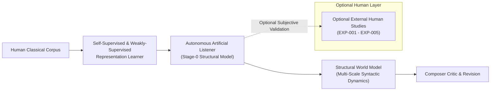
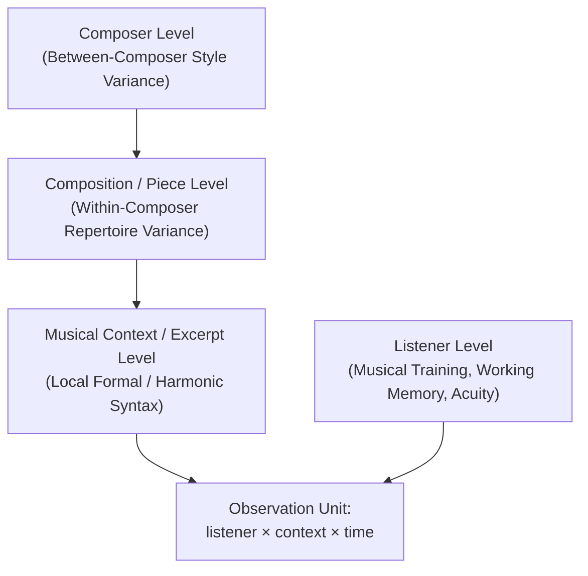
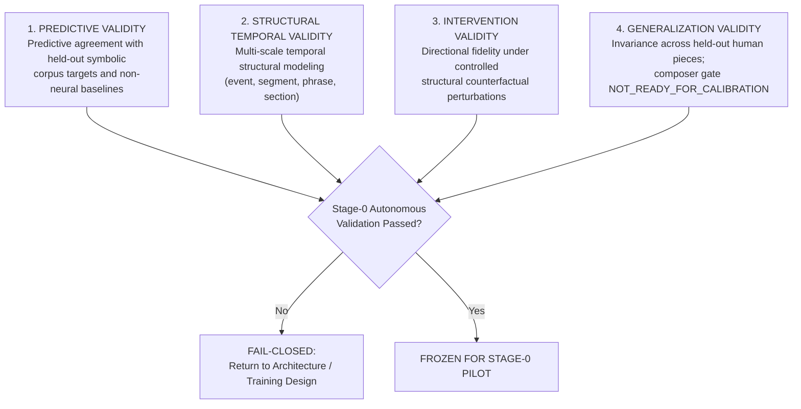

# PF-001 / PF-001A: Perception-First Artificial Listener
## Construct Operationalization & Autonomous Measurement Contract Report

**Authoritative Scientific Lineage:** Russian Piano Composer Project  
**Milestone:** PF-001A (Autonomous Structural Learning Contract)  
**Status:** AUTONOMOUS_CONTRACT_FROZEN_READY_FOR_CORPUS_FEASIBILITY  
**Branch:** `pf/001-listener-measurement-operationalization`  
**Governing Standard:** Corpus-Observable Structural Supervision & Multi-Scale Representation Learning  

---

### Executive Summary & Governing Scientific Inversion

Traditional symbolic music generation systems optimize language-modeling objectives over note sequences:
$$\min_\theta \mathbb{E}\left[-\log P_\theta(x_{t} \mid x_{<t})\right]$$
While statistical fluency over token n-grams can produce local stylistic coherence, optimizing next-token cross-entropy alone does not construct, represent, or track **musical experience**. A system trained solely to maximize symbolic likelihood lacks an internal model of structural expectation, closure, and motivic memory.

The **Perception-First Classical Composition** paradigm establishes that:
1. Music composition is fundamentally the intentional shaping of a dynamic **Listener Experience Trajectory (LET)** across time:
   $$\mathbf{LET}(t) = \left[ E_s(t), U_s(t), S_s(t), C_s(t), R_m(t), M_s(t), T_s(t), \dots \right]^T$$
2. Under PF-001A, **human participant judgments are NOT a prerequisite for building or gating Stage-0**. The primary teacher is the **corpus of human-composed classical music itself**.
3. The governing architectural flow is:
   $$\text{HUMAN CLASSICAL CORPUS} \longrightarrow \text{SELF-SUPERVISED LEARNER} \longrightarrow \text{ARTIFICIAL LISTENER}$$
   $$\longrightarrow \text{STRUCTURAL WORLD MODEL} \longrightarrow \text{COMPOSER} \longrightarrow \text{COUNTERFACTUAL CRITIC} \longrightarrow \text{REVISION}$$
4. Human listening studies are preserved as an **`OPTIONAL_EXTERNAL_VALIDATION`** layer. They are mandatory only when asserting an explicit empirical claim about human subjective perception (e.g. *"human listeners perceive this passage as tense"*).

Internal variables in Stage-0 are strictly designated as **structural constructs**:
- $E_s(t) = \text{Structural Expectation}$
- $U_s(t) = \text{Structural Uncertainty}$
- $S_s(t) = \text{Structural Surprise}$
- $C_s(t) = \text{Structural Closure}$
- $R_m(t) = \text{Motif Identity / Contrastive Recognition}$
- $M_s(t) = \text{Long-Range Structural Memory Trace}$

---

### 1. Stage-0 Artificial Listener Scope Freeze

To prevent premature architectural overreach, Stage-0 is strictly restricted to foundational structural primitives and their direct mathematical derivatives:

| Primitive | Mathematical Notation | Implementation Namespace | Stage-0 Autonomous Structural Target | Optional Human Correspondence Benchmark |
| :--- | :--- | :--- | :--- | :--- |
| **Expectation** | $E(t) = P(x_{t+1} \mid x_{\le t})$ | `expectation` | Held-out symbolic token distribution & perplexity vs non-neural baselines | `human_continuation_distribution` (EXP-001) |
| **Uncertainty** | $U(t) = H(P(x_{t+1} \mid x_{\le t}))$ | `uncertainty` | Derived model predictive entropy $H_{\text{AI}}(x_{\le t})$ | Response Entropy & Inverted Confidence ($1 - \text{conf}$) (EXP-002) |
| **Surprise** | $S(t) = -\log_2 P(x_t \mid x_{<t})$ | `expectation.derived_surprise` | Derived negative log-likelihood & $\text{SurpriseContrast} > 0$ | Graded Unexpectedness Likert & Latency Peak |
| **Closure** | $C(t) = P(\text{boundary} \mid x_{\le t})$ | `closure` | Corpus boundary detection & $\text{ClosureContrast} = C_c - C_t > 0$ | `human_closure_rating` (Completeness Probe) (EXP-003) |
| **Representation Invariance** | $R(t) = \text{sim}(z(A), z(T_{\text{ID}}(A)))$ | `recognition` / `invariance` | Contrastive cosine similarity $\ge \tau_{\text{identity}}$ under $T_{\text{ID}}$ transforms | Graded Theme Discrimination, RT, Confidence (EXP-004) |
| **Structural Memory** | $m_A(t) = \text{sim}(z(A), h_t)$ | `memory` | Source-segment recurrence trace & $\text{MemoryContrast} > 0$ | Signal Detection $d'$, Recall Edit Distance, Familiarity (EXP-005) |

**Strict Exclusion Rule:** Stage-0 explicitly prohibits modeling or computing narrative coherence, global musical quality, emotional causality, retrospective meaning, or semantic reinterpretation. These higher-order constructs are classified as `LATENT_NEEDS_VALIDATION` or `HIGH_LEVEL_NOT_OPERATIONAL`.

---

### 2. Rigorous Operationalization of Core Constructs

#### 2.1 Expectation ($E(t)$)
* **Autonomous Structural Target (PF-002A):**
  - Conceptual Definition: The model's conditional predictive probability distribution over immediate subsequent musical events (pitches, onsets, durations, harmonies) given accumulated symbolic context:
    $$P_{\text{AI}}(x_{t+1} \mid x_{\le t})$$
  - Validation Standard: Evaluated against held-out human-composed symbolic piece sequences on the `validation` split (PPL, bits/token) and tested for outperformance against predeclared non-neural baselines (`BASE_EMPIRICAL_MARGINAL`, `BASE_MARKOV_ORDER_1`, `BASE_NGRAM_4`).
  - No human behavioral choice distribution ($P_{\text{human}}$) is required for Stage-0 training, checkpoint selection, or pass/fail gating.
* **Optional Human Correspondence Target (EXP-001):**
  - Elicited empirical human choice probability distribution $P_{\text{human}}(x_{t+1} \mid x_{\le t})$ via K-alternative forced choice tasks or continuation allocation.
  - Prospective Validation Metrics: $\text{JSD}(P_{\text{human}} \parallel P_{\text{AI}})$, circle-of-fifths Wasserstein distance, rank-order correlation (Spearman's $\rho$).

#### 2.2 Uncertainty ($U(t)$)
* **Autonomous Structural Target (PF-002A):**
  - Conceptual Definition: The informational Shannon entropy across the model's conditional predictive distribution:
    $$H_{\text{AI}}(x_{\le t}) = -\sum_{x} P_{\text{AI}}(x \mid x_{\le t}) \log_2 P_{\text{AI}}(x \mid x_{\le t})$$
  - Structural Role: Tracks dispersion and structural ambiguity in corpus transition space. High uncertainty reflects multiple viable syntactic paths (e.g., developmental modulations).
* **Optional Human Correspondence Target (EXP-002):**
  - Aggregate Shannon entropy of human continuation choices $H_{\text{human}}(x_{\le t})$ combined with subjective confidence ratings and hesitation latency.
  - Optional validation only; human uncertainty reports do not determine PF-002A pass/fail.

#### 2.3 Closure Expectation ($C(t)$)
* **Autonomous Structural Target (PF-002A):**
  - Conceptual Definition: The structural boundary resolution probability $C_{\text{AI}}(t) = P_{\text{AI}}(\text{boundary} \mid x_{\le t}) \in [0, 1]$ learned from corpus-observable syntactic markers (cadential signatures PAC/IAC/HC/DC, hypermetric phrase boundaries, formal sectional terminations).
  - Validation Standard: Directional counterfactual contrast $\text{ClosureContrast} = C_c - C_t > 0$ (`CF-CLOSURE`).
  - Methodological Invariant: Closure is **not** equal to low tension. A peaceful open modal transition has zero closure; an authentic cadence preceding an urgent fermata has maximal closure.
* **Optional Human Correspondence Target (EXP-003):**
  - Proportion of human listeners judging context can terminate naturally at probe point $t$: $C_{\text{human}}(t) \in [0, 1]$.
  - Optional external validation only; human completion ratings are not required to train or calibrate Stage-0 structural closure.

#### 2.4 Representation Invariance & Discriminability ($R(A, A_i)$)
* **Autonomous Structural Target (PF-002A):**
  - Conceptual Definition: Invariance-to-discrimination contrastive latent representation over musical segments:
    $$\text{sim}(z(A), z(T_{\text{ID}}(A))) \ge \tau_{\text{identity}}, \quad \text{sim}(z(A), z(A_{\text{foil}})) \le \tau_{\text{discrimination}}$$
  - Calibration Procedure: Thresholds $\tau_{\text{identity}}$ and $\tau_{\text{discrimination}}$ are prospectively calibrated via grouped $K=5$-fold Youden's $J$ optimization clustered at `piece_id` with 2,000 bootstrap resamples on `development` data.
  - Methodological Distinction: Stage-0 evaluates **source-segment structural invariance** (`SOURCE_SEGMENT_INVARIANCE`). Human thematic identity (`THEME_MOTIF_IDENTITY`) is formally isolated as `THEME_MOTIF_IDENTITY_NOT_READY` pending Route A / Route B evidence.
* **Optional Human Correspondence Target (EXP-004):**
  - Human theme discrimination proportion, decision confidence, and response latency under controlled transformations.
  - Empirical human recognition decay curves are preserved for optional external human correspondence studies only, and do not control Stage-0 autonomous representation learning.

#### 2.5 Structural Memory ($M_s(t)$)
* **Autonomous Structural Target (PF-002A):**
  - Conceptual Definition: **`SOURCE_SEGMENT_STRUCTURAL_MEMORY`** evaluated as the explicit latent reactivation trace:
    $$m_A(t) = \text{sim}(z(A), h_t)$$
  - Validation Standard: Reactivation under literal and transformed recurrence ($A \to \text{context} \to T_{\text{ID}}(A)$) satisfying $\tau_{\text{memory}}$, and directional cue-disruption contrast $\text{MemoryContrast} = M_{\text{control}} - M_{\text{target}} > 0$ (`CF-SOURCE-SEGMENT-MEMORY`).
  - Full thematic memory gating is segregated as `THEMATIC_MEMORY_GATE = THEME_IDENTITY_DEPENDENT_NOT_READY`.
* **Optional Human Correspondence Target (EXP-005):**
  - Tripartite behavioral memory decomposition: Recognition sensitivity ($d'$), Recall symbolic reconstruction fidelity (Levenshtein distance), and Familiarity (Likert).
  - Human retention curves and decay parameters are evaluated only when testing psychological memory models, not for Stage-0 autonomous listener gating.

---

### 3. Advanced Perceptual Constructs & Formal Operationalization

#### 3.1 Theme Fertility ($T_R$)
* **Conceptual Definition:** The morphological generative breadth of a theme, defined as the volume, diversity, and coverage of its recognizable transformation space.
* **Operationalization:** Let $T(M) = \{M_1, M_2, \dots, M_K\}$ denote a prospectively standardized battery of morphological transformations (inversion, diminution, augmentation, chromatic mutation, accompaniment stripping, metric displacement).
* **Admissible Set:**
  $$T_R(M; \theta) = \left\{ M_i \in T(M) : R_{\text{human}}(M, M_i) \ge \theta \right\}$$
  where $\theta$ is a recognition threshold frozen prior to confirmatory testing.
* **Fertility Metric:** Represented as the convex hull volume, dispersion, and entropy of $T_R$ in transformation attribute space.
* **Methodological Invariant:** Theme Fertility must **not** be collapsed into an arbitrary scalar score or optimized automatically in Stage-0.

#### 3.2 Counterfactual Note Necessity as a Vector
Generic scalar "note importance" is rejected. For any note or chord $n$, counterfactual intervention $\delta$ produces a 6-dimensional perceptual deficit vector:
$$\Delta \mathbf{V}(n, \delta) = \begin{bmatrix}
\Delta E(n) \\
\Delta R(n) \\
\Delta T(n) \\
\Delta C(n) \\
\Delta A(n) \\
\Delta K(n)
\end{bmatrix} = \begin{bmatrix}
\text{Shift in continuation expectation} \\
\text{Drop in motif recognition} \\
\text{Disruption of harmonic tension curve} \\
\text{Premature or delayed closure effect} \\
\text{Attentional misrouting} \\
\text{Acoustic clarity / voice-leading roughness}
\end{bmatrix}$$
Standardized interventions include:
1. Note deletion
2. Pitch substitution (chromatic step, tritone substitute, diatonic neighbor)
3. Duration perturbation (halving, doubling)
4. Onset shift (anticipation, syncopation delay)
5. Register shift (octave displacement)

---

### 4. Classification & Status of All 24 Constructs

| Construct Name | Construct ID | Timescale | Measurement Class | Current Status | Stage-0 Scope |
| :--- | :--- | :--- | :--- | :--- | :--- |
| **Expectation** | `CST-EXP-001` | event_level | behavioral_continuation_distribution | `MEASURABLE_NOW` | YES (`expectation`) |
| **Uncertainty** | `CST-UNC-001` | event_to_phrase | response_distribution_dispersion | `MEASURABLE_NOW` | YES (`uncertainty`) |
| **Surprise** | `CST-SUR-001` | event_level | derived_information_salience | `MEASURABLE_NOW` | YES (`derived_surprise`) |
| **Closure Expectation** | `CST-CLO-001` | phrase_to_section | continuous_rating_boundary_detection | `MEASURABLE_NOW` | YES (`closure`) |
| **Theme Recognition** | `CST-REC-001` | motif_to_phrase | binary_graded_theme_discrimination | `MEASURABLE_NOW` | YES (`recognition`) |
| **Recognition Memory** | `CST-MEM-REC-001` | section_to_piece | signal_detection_discrimination | `MEASURABLE_NOW` | YES (`memory`) |
| **Recall Memory** | `CST-MEM-RCL-001` | phrase_to_piece | active_reconstruction_fidelity | `MEASURABLE_NOW` | YES (`memory`) |
| **Familiarity** | `CST-MEM-FAM-001` | phrase_to_piece | subjective_graded_familiarity_scale | `MEASURABLE_NOW` | YES (`memory`) |
| **Theme Fertility** | `CST-TFR-001` | piece_level | transformation_space_admissibility | `LATENT_NEEDS_VALIDATION` | NO |
| **Tension** | `CST-TEN-001` | continuous_trajectory | continuous_dial_rating | `LATENT_NEEDS_VALIDATION` | NO |
| **Delayed Preference** | `CST-DPR-001` | multi_day_longitudinal | paired_longitudinal_aesthetic_choice | `LATENT_NEEDS_VALIDATION` | NO |
| **Counterfactual Note Necessity** | `CST-CNN-001` | event_level | vector_perturbation_sensitivity | `LATENT_NEEDS_VALIDATION` | NO |
| **Phrase Breath** | `CST-PBR-001` | phrase_boundary | temporal_boundary_microtiming | `LATENT_NEEDS_VALIDATION` | NO |
| **Auditory Attention Routing** | `CST-AAR-001` | polyphonic_layer | selective_stream_auditory_probe | `LATENT_NEEDS_VALIDATION` | NO |
| **Semantic Reinterpretation** | `CST-SMR-001` | phrase_to_section | retrospective_role_reassignment | `LATENT_NEEDS_VALIDATION` | NO |
| **Retrospective Meaning** | `CST-RTM-001` | multi_section | retrospective_coherence_evaluation | `LATENT_NEEDS_VALIDATION` | NO |
| **Emotional Causality** | `CST-EMC-001` | transition_level | affective_transition_plausibility | `LATENT_NEEDS_VALIDATION` | NO |
| **Acoustic Intent** | `CST-ACI-001` | gesture_level | intentionality_attribution_rating | `LATENT_NEEDS_VALIDATION` | NO |
| **Affective Counterpoint** | `CST-AFC-001` | phrase_level | bivariate_affective_grid_rating | `LATENT_NEEDS_VALIDATION` | NO |
| **Narrative Coherence** | `CST-NRC-001` | piece_to_work | retrospective_narrative_mapping | `LATENT_NEEDS_VALIDATION` | NO |
| **Musical Meaning** | `CST-MMN-001` | piece_and_cultural | open_hermeneutic_discourse | `HIGH_LEVEL_NOT_OPERATIONAL` | NO |
| **Overall Musical Quality** | `CST-OMQ-001` | piece_level | unidimensional_scalar_judgment | `REJECTED_AS_DIRECT_SCALAR` | NO |
| **Emotional Depth** | `CST-EMD-001` | piece_level | subjective_holistic_valuation | `HIGH_LEVEL_NOT_OPERATIONAL` | NO |
| **Narrative Depth** | `CST-NRD-001` | piece_level | subjective_holistic_valuation | `HIGH_LEVEL_NOT_OPERATIONAL` | NO |

---

### 5. Explicit Rejection of High-Level Direct Scalarization

In alignment with psychometric and musicological principles, the following four concepts are explicitly rejected as direct numeric scalar optimization targets:
1. **Overall Musical Quality:** Quality is a multi-dimensional, socio-cultural, and highly contextual emergent phenomenon. Formulating a scalar $Q \in \mathbb{R}$ incentivizes reward-hacking of superficial heuristics (e.g. overt harmonic density or repetitive sensory consonant patterns) that ruin artistic depth.
2. **Musical Meaning:** Meaning arises from hermeneutic, historical, and semiotic relations between musical structures and human culture. It cannot be reduced to an internal token score.
3. **Emotional Depth:** Depth reflects multi-layered, often conflicting affective valences and existential resonance; compressing it into a scalar destroys affective counterpoint.
4. **Narrative Depth:** Narrative arises from long-range formal drama and thematic transformation across full works; it cannot be optimized as a localized reward signal.

These constructs may only be evaluated as emergent properties of validated lower-level constructs once Stage-0 and Stage-1 verification gates are fully passed.

---

### 6. The Primary Observation Unit & Hierarchical Dependency Structure

#### 6.1 Stage-0 Autonomous Structural Observation Unit
In Stage-0 autonomous structural learning and evaluation, the primary unit of statistical independence is:
$$\text{Cluster Unit} \equiv \text{piece\_id}$$
Every measure, segment, transformed derivative, and counterfactual pair originating from a score inherits that score's `piece_id`. Entire pieces are sampled or assigned during cross-validation fold splitting and bootstrap resampling ($B = 2000$). Segment counts must never be treated as independent degrees of freedom. Evaluation windows are stratified across:
- `segment_4m`: Contiguous 4-measure window (invariance, hard-negative discrimination, baseline n-grams).
- `segment_8m`: Contiguous 8-measure window (closure contrast, surprise contrast, formal boundaries).
- `section_window`: Formal structural section (long-range source-segment structural memory reactivation).

#### 6.2 Optional Human Study Observation Unit
In optional external human behavioral listening experiments (EXP-001 - EXP-005), the primary empirical observation unit is defined as:
$$\mathbf{Unit}_{\text{human}} = \text{listener} \times \text{musical context} \times \text{time}$$

##### Hierarchical Dependency Structure (Human Studies)
Every empirical human observation contains structured random and fixed variance across nested hierarchical strata:
$$\mathbf{y}_{ijkl} = \mu + \alpha_i (\text{Composer}) + \beta_{ij} (\text{Work} \mid \text{Composer}) + \gamma_{ijk} (\text{Context} \mid \text{Work}) + \zeta_l (\text{Listener}) + \epsilon_{ijkl}$$

To account for these dependencies in human studies without leakage:
1. Multi-level mixed-effects models must be specified for all behavioral analyses.
2. Cross-validation splits must isolate composers and listeners disjointly.
3. Pseudo-replication (e.g. treating multiple trials from the same participant as independent identically distributed samples) is strictly prohibited.

---

### 7. Prospective Validation Categories & Gating Criteria

To achieve certification as an authentic Autonomous Artificial Listener in Stage-0, a candidate model must pass four independent structural validation gates grounded in corpus observables:

1. **`PREDICTIVE_VALIDITY`:**
   - Predictive agreement with held-out symbolic corpus targets (`PPL`, bits/token) evaluated on the `validation` pool.
   - Outperformance over predeclared non-neural baselines (`BASE_EMPIRICAL_MARGINAL`, `BASE_MARKOV_ORDER_1`, `BASE_NGRAM_4`).
   - No human behavioral distribution is required for PF-002A Stage-0 training, checkpoint selection, threshold calibration, or pass/fail gating.
2. **`STRUCTURAL_TEMPORAL_VALIDITY`:**
   - Strict causal time-ordering ($t \le t_{\text{probe}}$) in sequential autoregressive evaluation.
   - Multi-scale temporal structural modeling spanning event, segment (`segment_4m`), phrase/section-proxy (`segment_8m`), and long-range source-segment timescales (`section_window`).
   - Stage-0 does not claim biological real-time auditory cognition or neural lag replication.
3. **`INTERVENTION_VALIDITY`:**
   - Directionally correct response to frozen structural counterfactuals:
     - Cadential disruption: $\text{ClosureContrast} = C_c - C_t > 0$ (`CF-CLOSURE`).
     - Controlled surprise perturbation: $\text{SurpriseContrast} = S_{\text{target}} - S_{\text{control}} > 0$ (`CF-SURPRISE`).
     - Source-segment recurrence-cue disruption: $\text{MemoryContrast} = M_{\text{control}} - M_{\text{target}} > 0$ (`CF-SOURCE-SEGMENT-MEMORY`).
4. **`GENERALIZATION_VALIDITY`:**
   - Stable performance across held-out human-composed pieces within the frozen `validation` split (22 pieces across Medtner and Lyadov) without parameter recalibration.
   - Note on composer generalization: `COMPOSER_GENERALIZATION_GATE = NOT_READY_FOR_CALIBRATION`. The Stage-0 split is an exploratory pilot and does not constitute a final external generalization claim. Candidate external composers (Taneyev, Bortkiewicz, Blumenfeld, Catoire) remain strictly firewalled (`EXTERNAL_TEST_CANDIDATE_FIREWALLED`).

#### 7.1 Optional External Human Validation Benchmarks (EXP-001 - EXP-005)

Human listening experiments are formally classified as **`OPTIONAL_EXTERNAL_HUMAN_VALIDATION_ONLY`**:
- **Non-Interference Invariant:** Human studies are **not** used for Stage-0 model fitting, checkpoint selection, threshold selection, or PF-002A pass/fail criteria.
- **Subjective Scope:** Human participant evaluation becomes relevant only when testing correspondence between structural proxies and subjective human perception (e.g., explicit empirical claims asserting that human listeners perceive a specific passage as tense, closing, or surprising).
- **Prospective Human Protocol Standards (for optional future reference):**
  - *Distributional Alignment (EXP-001):* Distributional distance between $P_{\text{AI}}(x \mid c)$ and $P_{\text{human}}(x \mid c)$ compared against empirical human noise ceiling benchmark; rank-order correlation of continuation likelihoods.
  - *Cognitive Latency Alignment (EXP-002):* Dynamic tracking of human response latency with biologically plausible cognitive lag ($200 \le \Delta t_{\text{lag}} \le 1200\text{ ms}$).
  - *Human Directional Agreement (EXP-003):* Directional change under perturbation matching human shift sign in benchmark listening cohorts.
  - *Human Listener Generalization (EXP-004 / EXP-005):* Generalization across unseen human listening cohorts and performance interpretations.
- **Lineage Rule:** Human validation must not retroactively redefine autonomous metrics or control Stage-0 training gates.

---

### 8. Scientific Fail-Closed Decision Rule

In accordance with repository charter and preregistration standards, the project enforces a **two-layer fail-closed decision rule**:

1. **For Autonomous Structural Claims (Stage-0):**
   > If any autonomous structural construct cannot be connected to a formally defined mathematical quantity, a reproducible corpus observable or intervention, a frozen metric, and a reproducible evaluation protocol, the construct shall **not** be assigned a surrogate metric, synthetic heuristic, or LLM-generated score. It must immediately be assigned the state `MEASUREMENT_DEFINITION_OPEN` or `LATENT_NEEDS_VALIDATION`. Human observability is **not** required for autonomous structural constructs.

2. **For Subjective-Human Claims:**
   > If an explicit scientific claim asserts equivalence to human subjective experience (e.g. *"human listeners perceive this passage as tense"*), the construct **must** be connected to an independent, reproducible human observable through an approved protocol (EXP-001 - EXP-005). In the absence of validated human behavioral data, subjective human equivalence claims are strictly prohibited.

This two-layer rule ensures that the Russian Piano Composer research trajectory remains firmly grounded in verifiable cognitive and musical science without creating false dependencies on uncollected human data for autonomous representation learning.
