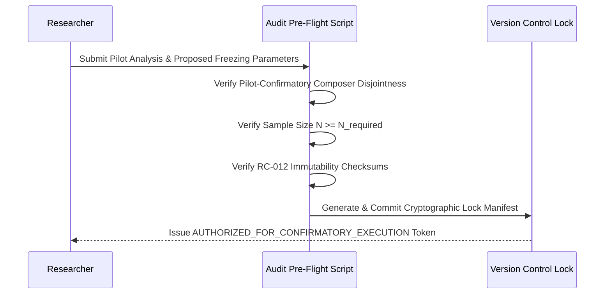

# PF-001 / PF-001A: Pilot versus Confirmatory Boundary Specification
## Autonomous Corpus Freezing, Pre-Registration Protocols, and Optional Human Validation Firewalls

**Document Type:** Scientific Methodology Specification  
**Milestone:** PF-001 / PF-001A  
**Project:** Russian Piano Composer  
**Status:** BOUNDARY_SPECIFICATION_FROZEN  
**Governing Standard:** Open Science Preregistration, Anti-HARK-ing Integrity & Feasibility-First Sourcing  

---

### PF-001A Scope Clarification & Methodological Firewall

> **PF-001A SCIENTIFIC REFINEMENT:**  
> Under PF-001A, the primary training pipeline is autonomous self-supervised learning from the classical corpus. The pilot-confirmatory boundary applies directly to:
> 1. **Autonomous Model Freezing:** Architecture, multi-scale token vocabulary, transformation batteries, and counterfactual tests must be frozen prior to unblinding held-out evaluation splits.
> 2. **Composer Cohort Freezing:** No external composer cohort may become `FROZEN` until a physical score feasibility audit is completed.
> 3. **Optional Human Validation:** If and when human behavioral studies (EXP-001 through EXP-005) are executed to validate subjective claims, the exploratory pilot study must remain strictly separated from the confirmatory test dataset via the firewall detailed below.

PF-001 erects an impenetrable **Methodological Firewall** between exploratory pilot studies and formal confirmatory testing:

```mermaid
graph LR
    subgraph PILOT["Phase 1: Exploratory Pilot (Open Exploration)"]
        P1["Estimate Response Variance"]
        P2["Calculate Noise Ceiling"]
        P3["Calibrate Rating Scales"]
        P4["Detect Floor / Ceiling Effects"]
        P5["Formal Power Analysis & Sample N"]
    end

    subgraph GATE["THE FREEZING GATE (Immutable Lock)"]
        G1["Freeze Primary Endpoints"]
        G2["Freeze Statistical Metrics"]
        G3["Freeze Falsification Criteria"]
        G4["Freeze External Composer Set"]
        G5["Cryptographic SHA-256 Lock"]
    end

    subgraph CONFIRM["Phase 2: Confirmatory Validation (Strict One-Shot)"]
        C1["Unblind External Test Repertoire"]
        C2["Execute Pre-Registered Protocols"]
        C3["Two-Process Independent Audit"]
        C4["Definitive Pass / Fail Ruling"]
    end

    PILOT --> GATE
    GATE --> CONFIRM
```

---

### 2. Permitted Activities in the Exploratory Pilot Phase

The pilot phase is explicitly designed to explore and calibrate the measurement instruments. During the pilot phase, researchers are **permitted and encouraged** to:
1. **Estimate Human Response Variance:** Quantify between-participant ($\sigma_{\text{between}}^2$) and within-participant ($\sigma_{\text{within}}^2$) variance across different musical forms.
2. **Estimate the Empirical Noise Ceiling:** Calculate split-half reliability coefficients ($R_{\text{split}}$) and distributional lower/upper bounds ($\text{JSD}_{\text{ceil}}$).
3. **Calibrate Rating Scales:** Detect skewness, anchor bias, or granularity issues in Likert vs continuous slider interfaces.
4. **Identify Floor and Ceiling Effects:** Discard stimulus items where task difficulty is either degenerate ($> 95\%$ consensus on non-diagnostic trivia) or hopelessly ambiguous ($< 5\%$ discrimination).
5. **Compute Formal Statistical Power:** Conduct Monte Carlo power simulations to determine the exact sample size ($N_{\text{listeners}}$ and $N_{\text{contexts}}$) required to achieve statistical power $\ge 0.90$ at significance level $\alpha = 0.01$.
6. **Examine Construct Inter-Correlations:** Inspect empirical correlations between constructs (e.g. verifying that Closure and Tension are psychometrically dissociated).

---

### 3. Strict Prohibitions for the Exploratory Pilot Phase

Under no circumstances may the pilot phase be misused to compromise confirmatory validity. The following actions are **strictly prohibited**:
1. **Pilot Data as Confirmatory Proof:** Pilot data can **never** be included in the confirmatory statistical sample or pooled with confirmatory test datasets.
2. **Post-Hoc Hypothesis Adjustment (HARK-ing):** Formulating or altering primary hypotheses after inspecting pilot outcomes without documenting the change as exploratory.
3. **Optimizing Thresholds on Pilot Data:** Selecting the theme recognition threshold $\theta$ or closure cutoff based on which value maximizes artificial listener performance on confirmatory items.
4. **Touching the External Test Cohort:** No works by composers in `external_test_held_out` (Taneyev, Bortkiewicz, Blumenfeld, Catoire) may be presented to participants during the pilot phase.

---

### 4. The Pre-Registration Freezing Gate

Prior to unblinding any confirmatory test data or conducting confirmatory participant trials, the following five artifacts must be irrevocably frozen in repository commits:

#### 4.1 Specification of Frozen Endpoints
For each Stage-0 construct, exactly one primary endpoint must be locked:

| Construct | Primary Endpoint Specification | Quantitative Falsification Boundary |
| :--- | :--- | :--- |
| **Expectation** | Jensen-Shannon Divergence $\text{JSD}(P_{\text{AI}} \parallel P_{\text{human}})$ across 100 contexts | $\text{JSD} > 1.5 \times \text{JSD}_{\text{ceil, upper}}$ or $\rho < 0.50$ |
| **Uncertainty** | Spearman rank correlation $\rho(H_{\text{AI}}, H_{\text{human}})$ | $\rho \le 0.40$ or $p \ge 0.01$ |
| **Closure** | Area Under ROC Curve (AUROC) for cadential termination | $\text{AUROC} < 0.80$ |
| **Recognition** | Spearman rank correlation $\rho(R_{\text{AI}}, \bar{R}_{\text{human}})$ across 6 transformation classes | $\rho < 0.65$ or $\text{AUROC} < 0.85$ |
| **Memory** | Root Mean Squared Error (RMSE) against empirical retention curve $d'(\tau)$ | $\text{RMSE} > 0.40$ standard units |

#### 4.2 Sample Size Determination Rule
Sample size must be computed using the frozen pilot variance estimate:
$$N_{\text{required}} = \frac{2 \left( z_{\alpha/2} + z_\beta \right)^2 \sigma_{\text{pilot}}^2}{\delta_{\text{min}}^2}$$
where $\alpha = 0.01$, $\beta = 0.10$ ($\text{Power} = 90\%$), and $\delta_{\text{min}}$ is the minimum clinically/scientifically meaningful effect size. No confirmatory data collection may begin with $N < N_{\text{required}}$.

#### 4.3 External Repertoire Freeze
The confirmatory test repertoire must be drawn strictly from the `external_test_held_out` composers, with an immutable manifest file committed with its SHA-256 checksum:
$$\text{Manifest: } \texttt{data/manifests/pf001\_external\_confirmatory\_manifest.json}$$

---

### 5. Transition Protocol from Pilot to Confirmation

The transition protocol is executed via an automated pre-flight audit script before confirmatory testing begins:

Any discrepancy, missing parameter, or detected data contamination halts the transition immediately under the repository's fail-closed governance model.
