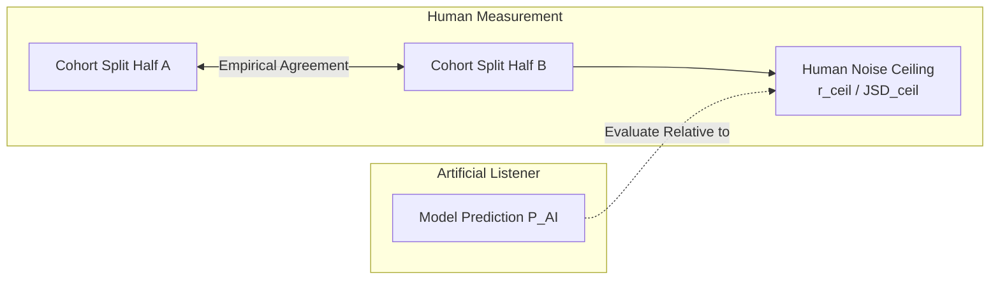
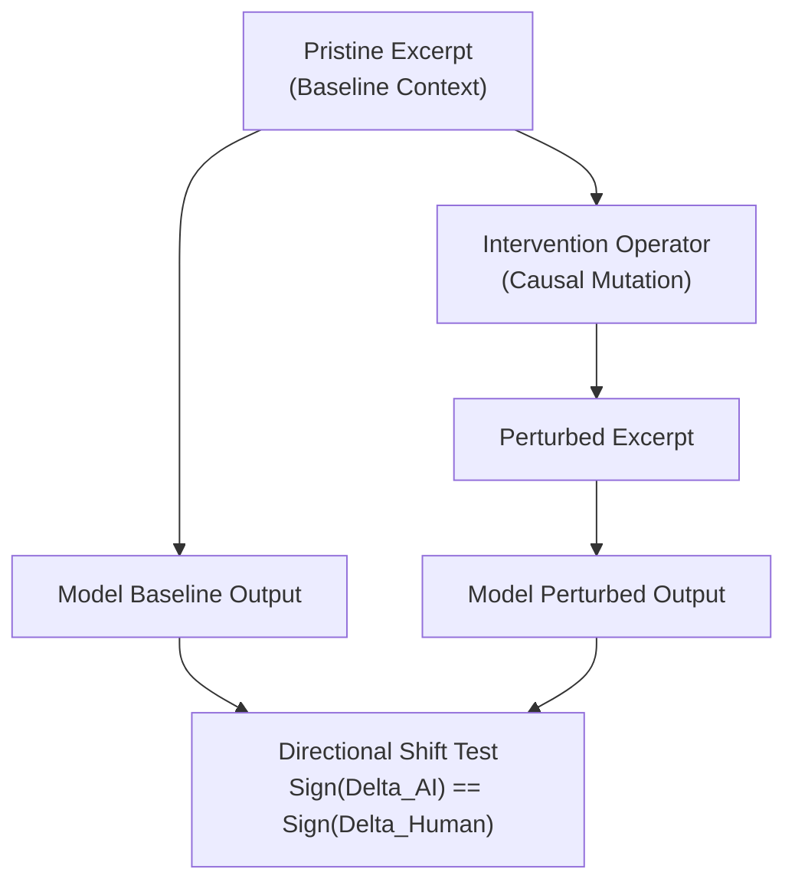
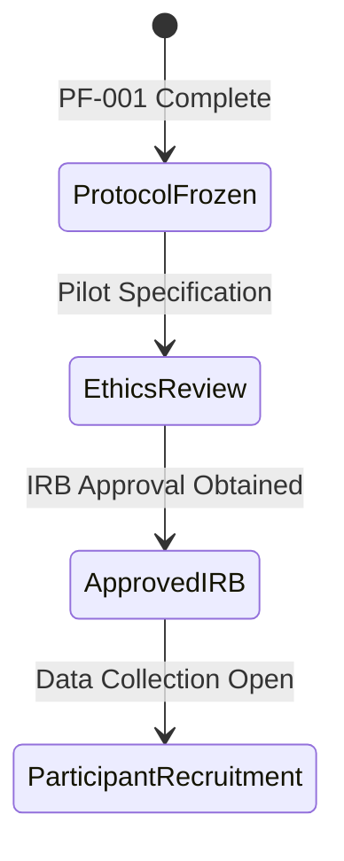

# PF-001: Stage-0 Human Measurement Protocol Specification
## Controlled Behavioral Experiments & Noise Ceiling Estimation Protocols

**Document Type:** Empirical Measurement Protocol Specification  
**Milestone:** PF-001  
**Project:** Russian Piano Composer  
**Status:** PROTOCOL_SPECIFICATION_FROZEN_NO_PARTICIPANT_DATA_COLLECTED  
**Scope:** Stage-0 Behavioral Tasks (EXP-001 through EXP-005)  

---

### Non-Collection Precondition & Governance Statement

> **CRITICAL SCIENTIFIC GOVERNANCE NOTICE:**  
> This document specifies experimental protocols **only**. In accordance with PF-001 governance, **no human participants have been recruited, contacted, or tested**, and **no participant data has been collected**. Prior to any physical execution of these experiments in subsequent milestones, formal Institutional Review Board (IRB) / Ethics Committee approval, written informed consent protocols, secure pseudonymous key storage, and institutional data retention agreements must be formally completed and approved. No ethical clearance is claimed at this stage.

---

### 1. Human-Human Reliability & Noise Ceiling Estimation

Before any candidate Artificial Listener model can be compared to human data, the empirical **Human Noise Ceiling** must be established for each construct. Claiming an AI model matches human perception is mathematically meaningless without knowing the upper limit imposed by human inter-individual variance and intra-individual measurement noise.

#### 1.1 Formal Noise Ceiling Formulations
1. **Distributional Noise Ceiling (Expectation & Uncertainty):**
   Given $N$ human participants divided into two random halves $A$ and $B$, empirical continuation distributions $P_A(x \mid c)$ and $P_B(x \mid c)$ are constructed. The lower and upper noise ceilings in Jensen-Shannon Divergence are defined via Monte Carlo split-half iterations ($B = 1000$ splits):
   $$\text{JSD}_{\text{ceil, upper}} = \mathbb{E}_{\text{splits}}\left[ \text{JSD}\left( P_A \parallel P_B \right) \right]$$
   $$\text{JSD}_{\text{ceil, lower}} = \mathbb{E}_{\text{splits}}\left[ \frac{1}{2} \left( \text{JSD}\left( P_A \parallel P_{\text{full}} \right) + \text{JSD}\left( P_B \parallel P_{\text{full}} \right) \right) \right]$$
   An AI model is deemed human-compatible only if:
   $$\text{JSD}(P_{\text{AI}} \parallel P_{\text{human}}) \le \text{JSD}_{\text{ceil, upper}}$$

2. **Continuous / Graded Noise Ceiling (Closure, Recognition, Memory):**
   For scalar ratings $y_{li}$ (listener $l$, stimulus context $i$), reliability is computed via the Spearman-Brown corrected split-half correlation:
   $$R_{\text{split}} = \frac{2 r_{AB}}{1 + r_{AB}}$$
   and the Intraclass Correlation Coefficient:
   $$\text{ICC}(2, k) = \frac{\text{MS}_{\text{stimulus}} - \text{MS}_{\text{error}}}{\text{MS}_{\text{stimulus}}}$$
   Model correlation $r(y_{\text{AI}}, \bar{y}_{\text{human}})$ cannot exceed $\sqrt{R_{\text{split}}}$ without overfitting idiosyncratic sample noise.

---

### 2. Experiment EXP-001: Continuation & Expectation Task

#### 2.1 Research Question
Does the probability distribution of human continuation choices $P_{\text{human}}(x_{t+1} \mid x_{\le t})$ align with the conditional probability distribution $P_{\text{AI}}(x_{t+1} \mid x_{\le t})$ across canonical Russian late-Romantic piano contexts?

#### 2.2 Construct
`CST-EXP-001` (Expectation) — Stage-0 Approved (`expectation`).

#### 2.3 Stimulus Definition
A curated library of 120 authentic musical contexts (8 to 32 quarter notes in duration), truncated precisely at pre-cadential, mid-phrase, or phrase-opening transition points. Each context is paired with 4 candidate continuation events:
- $C_1$: Authentic canonical continuation (original score)
- $C_2$: Diatonic voice-leading alternative (syntactically plausible, non-original)
- $C_3$: Chromatic substitution / deceptive resolution
- $C_4$: Syntactic violation (random voice-leading / register jump)

#### 2.4 Unit of Analysis
$\text{listener} \times \text{musical context} \times \text{candidate choice}$.

#### 2.5 Participant Response
Multi-point probability allocation (distributing 100 chips across 4 candidates) followed by subjective confidence slider (1-7 Likert) and millisecond reaction time.

#### 2.6 Dependent Variables
- Empirical continuation choice distribution $\mathbf{p}_{\text{human}} = [p_1, p_2, p_3, p_4]^T$
- Decision reaction latency (ms)
- Continuation confidence rating

#### 2.7 Control Conditions
1. **Null/Isomorphic Control:** Scrambled pitch context with preserved rhythm to test pitch-structure vs rhythmic-priming dominance.
2. **Deterministic Cadential Control:** Highly constrained voice-leading contexts (e.g., V7-I in root position) with known near-deterministic human consensus ($p_1 > 0.90$).

#### 2.8 Known Confounders
- Tonal hierarchy pitch frequency base-rates (Krumhansl-Schmuckler bias)
- Registral pitch proximity (tendency to expect nearest pitch)
- Metric accentuation of probe onset
- Listener years of formal keyboard training

#### 2.9 Exclusion Criteria
- Anticipatory responses (< 250 ms reaction time)
- Inattention catch trials (selecting an overtly discordant random cluster in catch items)
- Flat uniform allocation across all 4 candidates on $> 80\%$ of trials

#### 2.10 Randomization & Balancing
- Candidate screen positions (A, B, C, D) counterbalanced across trials using Latin-square design.
- Block-randomized presentation of contexts to prevent consecutive excerpts from the same piece or composer.

#### 2.11 Repeat Structure
A subset of 20 anchor contexts repeated across Session 1 and Session 2 (48 hours apart) to establish within-subject test-retest distribution stability.

#### 2.12 Planned Analysis
1. Calculate Jensen-Shannon Divergence $\text{JSD}(\mathbf{p}_{\text{human}}, \mathbf{p}_{\text{AI}})$ per context.
2. Mixed-effects Dirichlet-multinomial regression predicting choice probabilities with fixed effect of model logit and random intercepts for listener and composition.
3. Compare against human noise ceiling $\text{JSD}_{\text{ceil}}$.

#### 2.13 Falsification Condition
The model target is falsified if:
$$\text{JSD}(P_{\text{AI}} \parallel P_{\text{human}}) > 1.5 \times \text{JSD}_{\text{ceil, upper}} \quad \text{or} \quad \text{rank correlation } \rho(P_{\text{AI}}, P_{\text{human}}) < 0.50 \quad (p > 0.01)$$

---

### 3. Experiment EXP-002: Uncertainty & Perceptual Confidence Task

#### 3.1 Research Question
Does the informational entropy of the Artificial Listener $H_{\text{AI}}(\text{context})$ predict the dispersion of human expectation and self-reported subjective uncertainty?

#### 3.2 Construct
`CST-UNC-001` (Uncertainty) — Stage-0 Approved (`uncertainty`).

#### 3.3 Stimulus Definition
80 musical contexts stratified into 4 prospectively defined uncertainty categories based on classical music theory:
- *Stratum 1 (Low Uncertainty):* Prolonged dominant pedal preparing clear tonic arrival.
- *Stratum 2 (Moderate-Low):* Periodic antecedent phrase in diatonic major key.
- *Stratum 3 (Moderate-High):* Chromatic sequential modulation with unresolved root motion.
- *Stratum 4 (High Uncertainty):* Symmetrical octatonic / whole-tone hexachord passages (Scriabin / late Liszt).

#### 3.4 Unit of Analysis
$\text{listener} \times \text{musical context}$.

#### 3.5 Participant Response
Subjective uncertainty slider rating ($[0, 100]$: "How certain are you about what note/harmony must follow next?"), alongside continuation choice latency (ms).

#### 3.6 Dependent Variables
- Aggregate choice entropy $H_{\text{human}} = -\sum p_k \log_2 p_k$
- Subjective uncertainty rating $U_{\text{subj}} = 1 - \text{Confidence}$
- Mean response latency $\bar{RT}_{\text{context}}$

#### 3.7 Control Conditions
Unambiguous single-voice diatonic scale run (boundary anchor $H \to 0$) vs white-noise chromatic random cluster (boundary anchor $H \to \log_2 K$).

#### 3.8 Known Confounders
- General cognitive processing speed / hesitation
- Acoustic sensory dissonance (clashing overtones mistaken for structural uncertainty)
- Fatigue effects in late experimental blocks

#### 3.9 Exclusion Criteria
- Zero variance in confidence across the entire experimental block (slider non-use).
- Reaction times $> 15{,}000$ ms (distraction/inattention).

#### 3.10 Randomization & Repeat Structure
Interleaved pseudo-random presentation across strata; 15 anchor contexts re-tested at trial end.

#### 3.11 Planned Analysis
- Spearman rank correlation between $H_{\text{AI}}$ and $H_{\text{human}}$.
- Linear mixed-effects model: $U_{\text{subj}} = \beta_0 + \beta_1 H_{\text{AI}} + u_{\text{listener}} + v_{\text{context}} + \epsilon$.
- Mediation analysis testing whether response latency mediates the relation between $H_{\text{AI}}$ and $U_{\text{subj}}$.

#### 3.12 Falsification Condition
Falsified if model entropy $H_{\text{AI}}$ does not demonstrate a statistically significant positive monotonic relationship with human response entropy:
$$\rho(H_{\text{AI}}, H_{\text{human}}) \le 0.40 \quad \text{or} \quad p \ge 0.01$$

---

### 4. Experiment EXP-003: Phrase Closure & Cadential Boundary Task

#### 4.1 Research Question
Can the Artificial Listener model $C_{\text{AI}}(t)$ reliably predict human judgments of structural termination and phrase completeness without conflating closure with tension?

#### 4.2 Construct
`CST-CLO-001` (Closure Expectation) — Stage-0 Approved (`closure`).

#### 4.3 Stimulus Definition
100 phrase excerpts presented in pairs:
- *Condition A (Full Cadential Closure):* Phrase terminates on authentic tonic downbeat (PAC/IAC).
- *Condition B (Truncated / Deceptive / Half Cadence):* Phrase cut 1 beat prior to resolution, terminating on leading tone, dominant pedal, or deceptive submediant chord.
- *Condition C (Low Tension Open Modal Transition):* Quiet, consonant passage terminating mid-phrase with no cadential markers.

#### 4.4 Unit of Analysis
$\text{listener} \times \text{phrase excerpt} \times \text{truncation point } t$.

#### 4.5 Participant Response
Binary completeness probe: "Could this phrase naturally and syntactically end here?" (Yes/No), followed by a continuous completeness rating slider $[0.0, 1.0]$.

#### 4.6 Dependent Variables
- Proportion of positive termination responses $P(\text{termination} \mid t)$
- Graded structural completeness rating $C_{\text{human}}(t) \in [0, 1]$
- Verification of dissociation: $C_{\text{human}}$ vs Continuous Tension dial rating

#### 4.7 Control Conditions
- Cadence in isolation vs cadence embedded in continuous performance (testing hypermetric context effect).
- Pure rhythmic fermata without harmonic resolution (decoupling duration from tonal closure).

#### 4.8 Known Confounders
- Performance tempo ritardando and expressive decrescendo cues
- Hypermetric length bias (e.g. strong expectation of 4-bar or 8-bar symmetry)
- Dynamic energy decay

#### 4.9 Exclusion Criteria
- Failure on positive control (rejecting full cadential tonic of simple classical hymn).
- Failure on negative control (accepting mid-scale eighth note as full cadence).

#### 4.10 Randomization & Balancing
Equal presentation of truncated vs completed versions across counterbalanced listener groups.

#### 4.11 Planned Analysis
- Receiver Operating Characteristic (ROC) curve analysis: Area Under Curve (AUC) for predicting binary human termination consensus.
- Cross-tabulation demonstrating orthogonality: $\text{Cov}(C_{\text{human}}, T_{\text{human}}) \ne -1$ across modal open contexts.

#### 4.12 Falsification Condition
Falsified if:
$$\text{AUC}(C_{\text{AI}}, C_{\text{human}}) < 0.80 \quad \text{or} \quad \text{Brier}(C_{\text{AI}}, C_{\text{human}}) > 0.20$$

---

### 5. Experiment EXP-004: Theme Recognition & Transformation Discrimination Task

#### 5.1 Research Question
Does the Artificial Listener's thematic similarity metric $R_{\text{AI}}(M, M_i)$ accurately predict human recognition rates and decision confidence under systematic motivic transformations?

#### 5.2 Construct
`CST-REC-001` (Theme Recognition) — Stage-0 Approved (`recognition`).

#### 5.3 Stimulus Definition
30 reference themes $M$ from Russian Romantic repertoire. For each theme, 6 controlled transformations $M_i$ are generated:
1. $T_1$: Exact pitch transposition (up minor 3rd)
2. $T_2$: Rhythmic augmentation (durations $\times 2$, tempo matched)
3. $T_3$: Melodic inversion (mirror intervallic steps)
4. $T_4$: Retrograde (intervallic reverse)
5. $T_5$: Harmonic recontextualization (melody preserved, underlying harmony substituted)
6. $T_6$: Unrelated distractor foil (different composer, matched key/tempo)

#### 5.4 Unit of Analysis
$\text{listener} \times \text{theme pair } (M, M_i)$.

#### 5.5 Participant Response
Theme identification judgment on 6-point scale:
- 1: Definitely different theme
- 2: Probably different theme
- 3: Unsure / possible derivative
- 4: Probably transformed version of theme
- 5: Definitely transformed version of theme
- 6: Identical theme
Recorded with millisecond reaction latency.

#### 5.6 Dependent Variables
- Mean recognition rating $\bar{R}_{\text{human}}(M, M_i)$
- Binary recognition classification rate ($R \ge 4$)
- Discrimination reaction time (ms)

#### 5.7 Control Conditions
- Identity control ($M, M$): Test-retest recognition ceiling.
- Random permutation control: Scrambled pitch sequence with same pitch-class set.

#### 5.8 Known Confounders
- Absolute pitch memory vs relative pitch processing
- Transposition distance (tritone transposition harder than fifth)
- Accompanying texture complexity masking head motif

#### 5.9 Exclusion Criteria
- False alarm rate on unrelated foils $T_6 > 35\%$.
- Reaction times $< 300\text{ ms}$ or $> 10{,}000\text{ ms}$.

#### 5.10 Randomization & Balancing
Latin-square allocation so no participant hears the same theme in more than two transformation variants.

#### 5.11 Planned Analysis
- Spearman correlation between $R_{\text{AI}}(M, M_i)$ and human recognition ratings across all transformation classes.
- Linear degradation check: verify that both human and AI exhibit the empirical hierarchy:
  $$\bar{R}(T_1) > \bar{R}(T_5) > \bar{R}(T_2) > \bar{R}(T_3) > \bar{R}(T_4) > \bar{R}(T_6)$$

#### 5.12 Falsification Condition
Falsified if:
$$\rho(R_{\text{AI}}, \bar{R}_{\text{human}}) < 0.65 \quad \text{or} \quad \text{AUROC}(\text{theme vs foil}) < 0.85$$

---

### 6. Experiment EXP-005: Delayed Memory Retention & Decay Task

#### 6.1 Research Question
How does thematic memory decay across delay intervals $\Delta t$, and does the Artificial Listener's memory buffer accurately track human recognition memory ($d'$), cued recall fidelity, and familiarity without presupposing an arbitrary exponential decay law?

#### 6.2 Construct
`CST-MEM-REC-001`, `CST-MEM-RCL-001`, `CST-MEM-FAM-001` — Stage-0 Approved (`memory`).

#### 6.3 Stimulus Definition
24 target themes exposed during an initial acquisition block. Subsequent probe blocks occur across 4 retention intervals:
- $\tau_1 = 30\text{ seconds}$ (working memory / short-term buffer)
- $\tau_2 = 5\text{ minutes}$ (with intervening musical distractor tasks)
- $\tau_3 = 20\text{ minutes}$ (intermediate consolidation)
- $\tau_4 = 48\text{ hours}$ (long-term episodic / familiarity trace)

#### 6.4 Unit of Analysis
$\text{listener} \times \text{theme} \times \text{delay interval } \tau$.

#### 6.5 Participant Response
Three sequential sub-tasks per probe:
1. **Familiarity Probe:** "How familiar does this theme sound?" (1-7 Likert).
2. **Recognition Probe (Old/New):** "Did you hear this theme earlier in this session?" (Yes/No + Confidence 1-7).
3. **Cued Recall Probe:** 2-note opening cue played; participant hums/sings or taps continuation on MIDI keyboard.

#### 6.6 Dependent Variables
- Recognition sensitivity: $d'(\tau) = \Phi^{-1}(H(\tau)) - \Phi^{-1}(FA(\tau))$
- Cued recall reconstruction accuracy: Normalized Levenshtein distance $\text{LD}(S_{\text{recall}}, S_{\text{orig}})$
- Familiarity rating $F(\tau)$

#### 6.7 Control Conditions
- Zero-delay immediate recall baseline.
- Unexposed distractor themes tested at each delay interval to control for baseline false-alarm inflation.

#### 6.8 Known Confounders
- Tonal interference from intermediate musical distractor stimuli
- Individual differences in auditory working memory capacity (measured via backward digit span)
- Vocal production motor accuracy in recall reproduction

#### 6.9 Exclusion Criteria
- Participants failing to attend to acquisition block ($d'(\tau_1) < 0.50$).
- More than 20% missed probe trials in Session 2.

#### 6.10 Randomization & Balancing
Themes counterbalanced across retention intervals using balanced incomplete block design.

#### 6.11 Planned Analysis
1. Empirical decay curve fitting: Compare power law ($d'(\tau) = a \tau^{-b}$), hyperbolic ($d'(\tau) = a / (1 + b\tau)$), and exponential ($d'(\tau) = a e^{-\lambda \tau}$) models via Bayesian Information Criterion (BIC).
2. Test whether the Artificial Listener memory activation matches the winning empirical functional form.

#### 6.12 Falsification Condition
Falsified if:
- Model predicts memory retention that deviates from empirical human $d'(\tau)$ with $\text{RMSE} > 0.40$ standard units.
- Model assumes an a priori exponential law that is decisively rejected by empirical data ($\Delta \text{BIC} > 10$ in favor of power/hyperbolic decay).

---

### 7. Prospective Intervention Testing Suite (Synthetic In-Silico Protocols)

To ensure that the Artificial Listener responds causally to musical modifications rather than relying on surface correlates, the following controlled perturbation tests are prospectively locked:

| Intervention ID | Target Construct | Mutation Operation | Prospective Human Response Direction | Required Model Response Direction |
| :--- | :--- | :--- | :--- | :--- |
| **INT-EXP-001** | Expectation | Replace tonic cadential resolution with foreign tritone root | Continuation probability mass collapses from $\approx 0.85$ to $< 0.05$ | $P_{\text{AI}}(\text{tritone}) < 0.05$; Surprisal surges $> 4.0\text{ bits}$ |
| **INT-UNC-001** | Uncertainty | Modulate into symmetrical whole-tone chord | Choice distribution entropy surges; confidence drops | $H_{\text{AI}}$ increases by $\ge 1.5\text{ bits}$ |
| **INT-CLO-001** | Closure | Shift cadence onset from strong downbeat to weak upbeat | Closure rating collapses; expectation of continuation surges | $C_{\text{AI}}(t_{\text{upbeat}}) < 0.20$ |
| **INT-REC-001** | Recognition | Invert melodic contour while preserving rhythm | Recognition drops by $30-50\%$; reaction time increases | $R_{\text{AI}}(M, M_{\text{inv}}) \le 0.60 \times R_{\text{AI}}(M, M)$ |
| **INT-MEM-001** | Memory | Double musical distractor density in retention interval | Recognition $d'$ drops; retroactive interference observed | Memory buffer activation drops proportionally to interference |

---

### 8. Protocol Execution Governance Gate

Before transitioning this protocol specification to active participant recruitment, the following gate criteria must be formally verified:

1. **Gate 1: Preregistration Lock** — All 5 task designs, sample size determinations, and noise ceiling formulas frozen in version control.
2. **Gate 2: Institutional Ethics Review** — Formal IRB protocol approved with certified participant consent forms.
3. **Gate 3: Data Minimization & Privacy** — Automated ingestion pipeline must verify that participant data contains strictly pseudonymous IDs (`LST-XXXXXXXX`) with zero PII.
4. **Gate 4: Fail-Closed Audit** — Any trial with protocol deviation or stimulus corruptions must be automatically quarantined.
