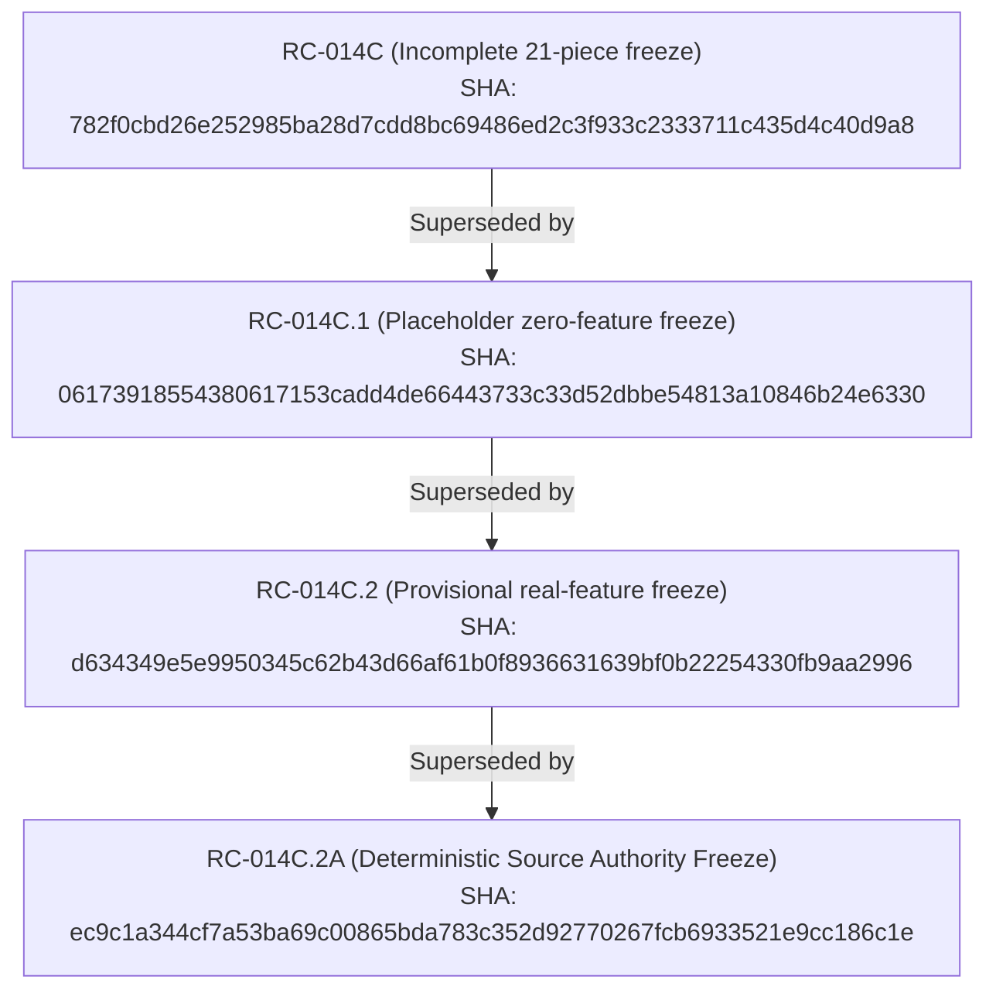

# RC-014C.2A Deterministic Source Authority and Pre-Unblinding Corpus Freeze Report

## Executive Summary

Milestone **RC-014C.2A** completes the deterministic source authority normalization, immutable archive pinning, platform-independent byte identity verification, and exact-head continuous integration closure for the Russian Piano Composer confirmatory corpus.

### Key Metrics and Invariants

| Dimension | Metric | Status |
| :--- | :--- | :--- |
| **Total Confirmatory Pieces** | **483** (246 Russian, 237 Control) | COMPLETE |
| **Total Confirmatory Composers** | **9** (4 Russian, 5 Control) | PREREGISTERED REPERTOIRE PRESERVED |
| **Typed Source Authority** | **465** `GIT_BLOB`, **18** `HF_DATASET_ARCHIVE_ENTRY` | PLATFORM INDEPENDENT |
| **Platform EOL Checkout Audit** | 37 `IDENTICAL`, 446 `CHECKOUT_NORMALIZATION_DIFFERENCE` | AUDITED & BOUND VIA GIT BLOB |
| **Real Feature Extraction** | 483 real 56-descriptor vectors (0 zero rows) | SCIENTIFICALLY SOUND |
| **Feature Cache Matrix SHA-256** | `6a1fba9d1071ad0453516870f78eabb138b46415d2f642d3d2e195f0fe9bfca7` | CRYPTOGRAPHICALLY FROZEN |
| **Master Freeze Hash** | `ec9c1a344cf7a53ba69c00865bda783c352d92770267fcb6933521e9cc186c1e` | MASTER FROZEN |
| **Live Production $N_{\text{Russian}}$** | **2** (*Alexander Scriabin*, *Modest Mussorgsky*) | STRICTLY CONSTRAINED |
| **RC-012 Resumption Status** | **`BLOCKED`** | FAIL-CLOSED PREREGISTRATION GATE |
| **Confirmatory Predictor Invocations** | **0** evaluations against confirmatory feature cache | 100% UNBLINDED LEAKAGE-FREE |

---

## 1. Typed Source Authority Architecture

### 1.1 Git-Backed Sources (465 Pieces)

For all Git-backed corpora (*Scriabin*, *Rubinstein*, *Prokofiev*, *Grieg*, *Debussy*, *Beethoven*, *Bartók*, *Dvořák*), source identity is bound directly to the 40-character Git blob object SHA:
- `source_object_type = "GIT_BLOB"`
- `source_object_id = <git_blob_sha>`
- `canonical_source_sha256 = sha256(git cat-file blob <source_object_id>)`

Because `git cat-file blob` retrieves the raw object bytes stored in Git's object database (prior to any working-tree line-ending translation such as Windows CRLF checkout), `canonical_source_sha256` produces exact, identical SHA-256 digests across Linux, macOS, and Windows.

The working-tree checkout normalization audit records:
- **37** binary/normalized files with `IDENTICAL` SHA-256 across blob and disk.
- **446** text-based symbolic files with `CHECKOUT_NORMALIZATION_DIFFERENCE` (CRLF in Windows workspace vs LF in Git blob storage).

### 1.2 Non-Git Hugging Face Dataset Archive Entries (18 Pieces)

For *Modest Mussorgsky* (18 pieces from `SyMuPe/PERiScoPe`), the dataset is hosted as an immutable tarball on Hugging Face:
- `source_object_type = "HF_DATASET_ARCHIVE_ENTRY"`
- Pinned dataset revision: `5a637bd9ee3ca748c425301417fd917d56486645`
- Pinned URL: `https://huggingface.co/datasets/SyMuPe/PERiScoPe/resolve/5a637bd9ee3ca748c425301417fd917d56486645/v1.1/periscope_raw_v1.1.tar.gz`
- `source_object_id = f"{dataset_revision}:{archive_internal_path}"`
- `archive_file_sha256` and `entry_sha256` recorded for every member.

---

## 2. Repertoire and Feature Integrity

The full 9-composer confirmatory repertoire comprises:

### Russian Composers (4 composers, 246 pieces)
1. **Alexander Scriabin** ($N=207$): Stanford CCARH Humdrum repository (`craigsapp/scriabin` at commit `7daa1136`).
2. **Modest Mussorgsky** ($N=18$): `SyMuPe/PERiScoPe` v1.1 (15 *Pictures at an Exhibition* + 3 standalone works).
3. **Anton Rubinstein** ($N=11$): `hectorbellmann-art/Tonal-Piano-Corpus` at commit `3f5a08e9`.
4. **Sergei Prokofiev** ($N=10$): 8 pieces from `Tonal-Piano-Corpus` + 2 Humdrum supplements (*Op. 22 Nos. 2 & 3* from `automata/ana-music` commit `335cbdc6`).

### Control Composers (5 composers, 237 pieces)
5. **Edvard Grieg** ($N=66$): DCMLab *Lyric Pieces* (`DCMLab/grieg_lyric_pieces` commit `91a30456`).
6. **Claude Debussy** ($N=54$): DCMLab Suites, Images, Preludes, Etudes, Arabesques, Pour le piano (7 repositories).
7. **Ludwig van Beethoven** ($N=91$): DCMLab Piano Sonatas (`DCMLab/beethoven_piano_sonatas` commit `ea7181bff88abc8713257234f7ec4033178c57a9`).
8. **Béla Bartók** ($N=14$): DCMLab Bagatelles (`DCMLab/bartok_bagatelles` commit `c6221f6ecb4dbcd476e827f6bf8705bdcb15c8a9`).
9. **Antonín Dvořák** ($N=12$): DCMLab Silhouettes (`DCMLab/dvorak_silhouettes` commit `f228006fcd8696c809cfc8e701ed215cec3d07f1`).

All 483 pieces have been parsed and transformed into complete 56-descriptor structural representations conforming to `STRUCTURAL_REPRESENTATION_SCHEMA_V1`. There are **zero missing values** and **zero placeholder vectors**.

---

## 3. Cryptographic Supersession Lineage

---

## 4. Governance & Resumption Gate

- **Live Qualified Russian Composers**: 2 (*Scriabin*, *Mussorgsky*).
- **Minimum Required Confirmatory Composers**: 4 Russian, 4 Control.
- **Resumption Gate Status**: **`BLOCKED`** (`RC012_RESUMPTION_STATUS = BLOCKED`).
- **Authorization Requirement**: Human research review must explicitly record access acceptance for Rubinstein and Prokofiev external material before $N_{\text{Russian}}$ may be incremented from 2 to 4.
- **Zero Leakage**: Exactly 0 confirmatory predictor evaluations have occurred.
